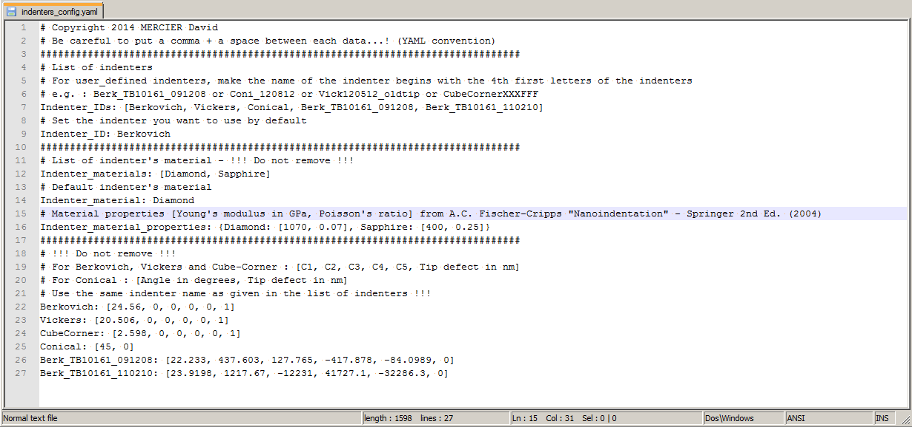

Configuration
==============

.. include:: includes.rst

What is a YAML File ?
#########################

*"YAML is a human friendly data serialization standard for all programming languages."*

`Visit the YAML website for more informations. <http://www.yaml.org/>`_

`Visit the YAML code for Matlab. <http://code.google.com/p/yamlmatlab/>`_

You have to update the YAML configuration files in order to use correctly Matlab toolbox.

The YAML configuration files
#############################

Three YAML configuration files are used in the Matlab toolbox :
  - indenters_config.yaml
  - numerics_config.yaml
    
*indenters_config.yaml* provides indenter's properties (geometry and material).
    
*data_config.yaml* provides a path on your computer to select easily your data.
    
*numerics_config.yaml* provides numerical parameters used by the toolbox.

How to modify YAML configuration files ?
##############################################

Please find the 3 YAML configuration files in the
`YAML folder <https://github.com/DavidMercier/nanoind-data-analysis/tree/master/YAML_config_files>`_.

   
   *Screenshot of the YAML configuration file used for indenter's properties.*

*indenters_config.yaml* can be used to change indenter's properties :
    - Write your Indenter_ID(s) (e.g. : Conical indenter, Berk_TB10161_091208, ...);
    - Write indenter's properties (e.g. : Berk_TB10161_091208: [22.233, 437.603, 127.765, -417.878, -84.0989, 0]);
    
..  warning::
    * For user-defined indenters, make the name of the indenter begins with the 4th first letters of the indenter name (e.g.: 'Berk_130214' for 'Berkovich').
    * Do not remove standard indenters and standard materials !
    
    
*data_config.yaml* can be used to set the default absolute path for the folder where you store your indentation data.

*numerics_config.yaml* can be used to change the numerical parameters used by the toolbox from their standard values.

..  warning::
    * Be careful to put a comma + a space between each data...! (YAML convention)
    * Use # in the beginning of the line to add comments.

It is also possible to edit and to load the different YAML configuration files, via the customized menu of the GUI.