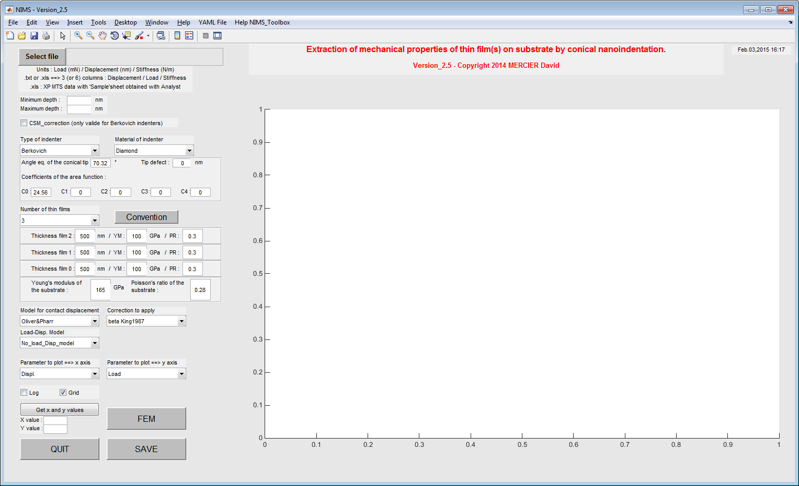
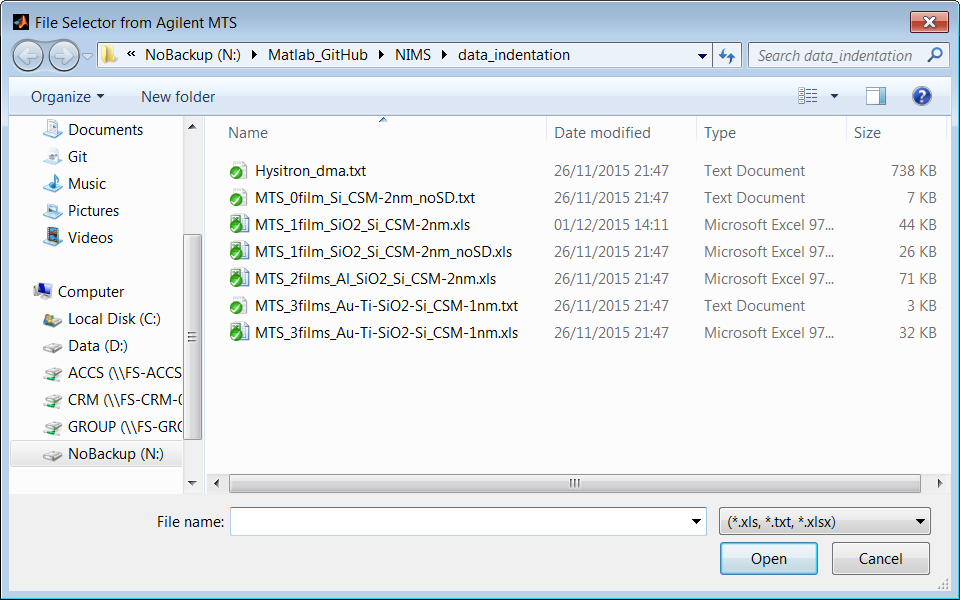
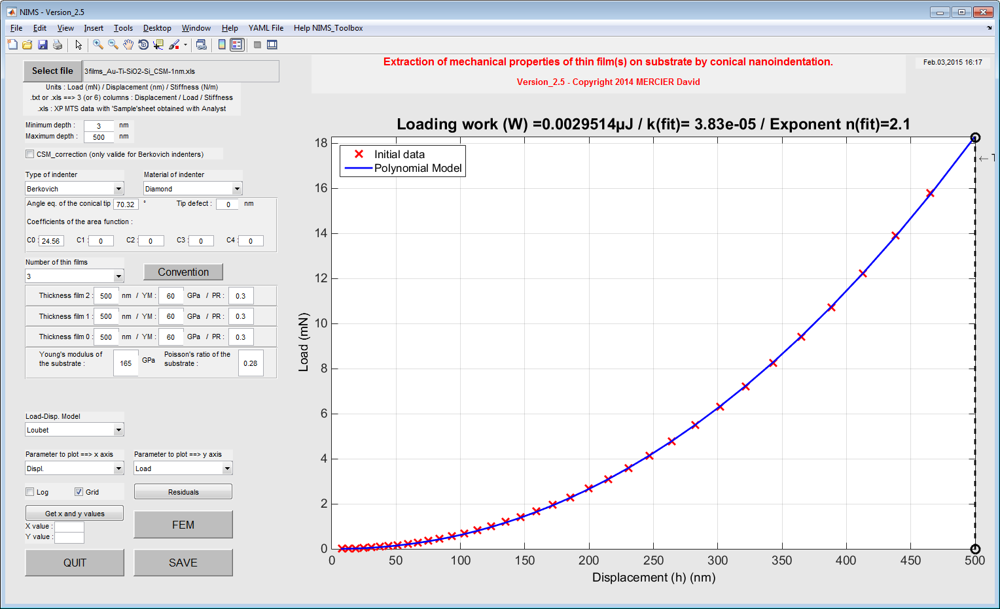
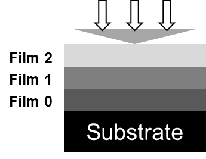
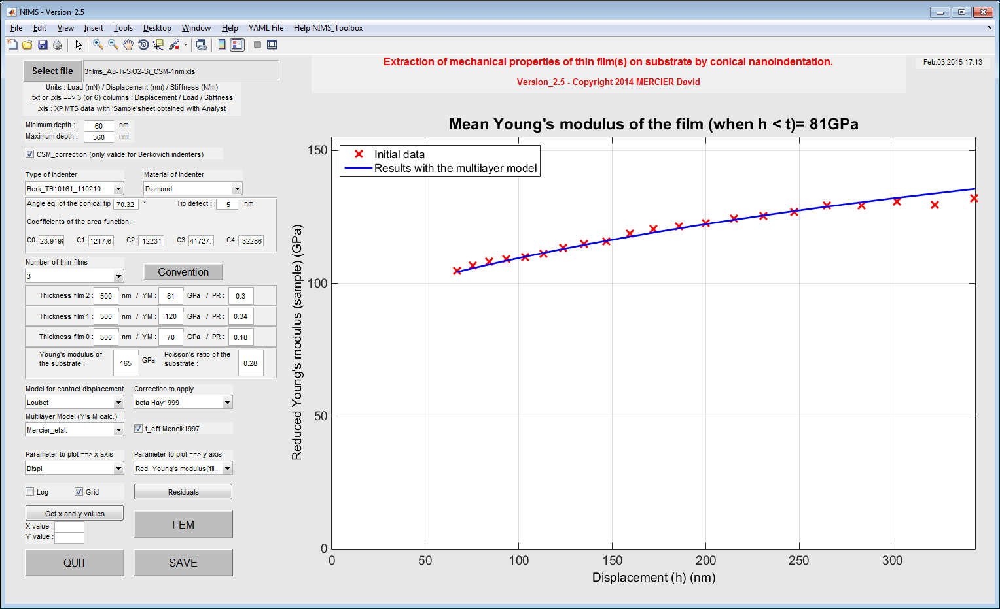
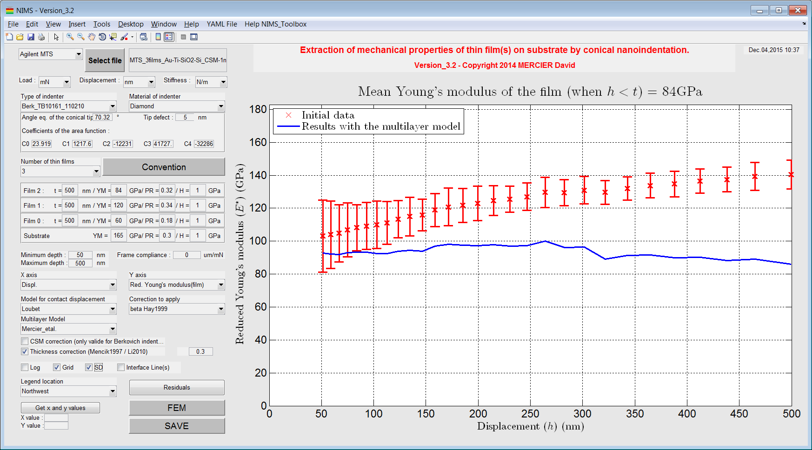

Getting started
================

.. include:: includes.rst

First of all, download the source code of the |matlab| toolbox.

`Source code is hosted at Github. <https://github.com/DavidMercier/NIMS>`_

To have more details about the use of the toolbox, please have a look to :

.. code-block:: matlab

   Getting_started.txt
  
How to use the GUI for indentation data analysis ?
####################################################

First of all a GUI is a Graphical User Interface.

* Create or update your personal YAML config. file stored in the
  `YAML folder <https://github.com/DavidMercier/nanoind-data-analysis/tree/master/yaml_config_files>`_

`See here how to create / modify your YAML file... 
<http://nims.readthedocs.org/en/latest/configuration.html>`_

* Run the following |matlab| script and answer 'y' or 'yes' to add path to the |matlab| search paths :

.. code-block:: matlab

   path_management.m
   
* Then, run the following |matlab| script :

.. code-block:: matlab

   demo.m

* The following window opens:

   
   * - Screenshot of the main window of the NIMS toolbox.*

* Import your (nano)indentation results, by clicking on the button 'Select file'.
  `Click here to have more details about valid format of data.
  <http://nims.readthedocs.org/en/latest/examples.html>`_

* A load-displacement curve is plotted (with a power law fit).
  The loading work is also given in the title of the plot.

* It is possible to plot the stiffness (raw data) without
  setting the GUI for Young's modulus calculation.

   
   *F - ile selector.*

   
   * - Plot of the load-displacement curve after loading of data.*

* Choose and set (if needed) the indenter used to obtain (nano)indentation data.
* Select the lowest and the highest depth values (optional).
* Set the CSM correction (Berkovich indenter only !) (optional).
* Set the number of layers of your sample (0 = only bulk material, 1/2/3 = 1 to 3 thin layers on a substrate) (see :numref:`convention_multilayer`).

   
   * - Convention use to define multilayer specimen.*

* Set the thickness, the Poisson's coefficient and the Young's modulus to each layer.
* Select the model to use for the contact displacement calculation and select the correction to apply.
* Select 'Red. Young's modulus(film+sub)' or 'Red. Young's modulus(film)' in order to plot
  the evolution of the reduced Young's modulus (raw calculation) of the sample vs. the evolution
  of the reduced Young's modulus (modeled) of the sample and/or of the thin film.
* Select the analytical bilayer or the multilayer model to use for the modelling of the reduced Young's modulus of the top thin film.
* Press the button 'SAVE' and a `YAML results file
  <https://github.com/DavidMercier/nanoind-data-analysis/blob/master/data_indentation/MTS_3films_Au-Ti-SiO2-Si_CSM-1nm.xls_Mercier%26al..yaml>`_
  and a `picture of the figure (.png format) <https://github.com/DavidMercier/nanoind-data-analysis/blob/master/data_indentation/MTS_3films_Au-Ti-SiO2-Si_CSM-1nm.xls_Mercier%26al..yaml.png>`_
  are created and stored in the `following folder <https://github.com/DavidMercier/nanoind-data-analysis/tree/master/data_indentation>`_.
* Press the button 'FEM' and generate a `Python script <https://github.com/DavidMercier/nanoind-data-analysis/blob/master/data_indentation/MTS_3films_Au-Ti-SiO2-Si_CSM-1nm.py>`_
  to model nanoindentation of multilayer sample based on parameters used in the GUI for ABAQUS.

   
   * - Plot of the evolution of the Young's modulus of the sample with the elastic multilayer model in function of the indentation depth.*
   

   
   * - Plot of the evolution of the Young's modulus of the film with the elastic multilayer model in function of the indentation depth.*
   
Links
#######

* `Guidata on Matlab website. <http://www.mathworks.fr/fr/help/matlab/ref/guidata.html>`_   
* `Matlab GUI. <http://www.mathworks.com/discovery/matlab-gui.html>`_
* `Coding GUI behavior. <http://www.mathworks.fr/fr/help/matlab/code-to-run-the-gui.html?searchHighlight=gui>`_