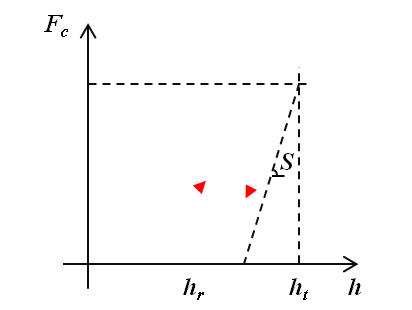
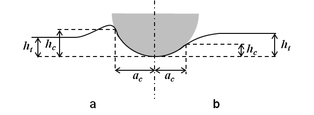
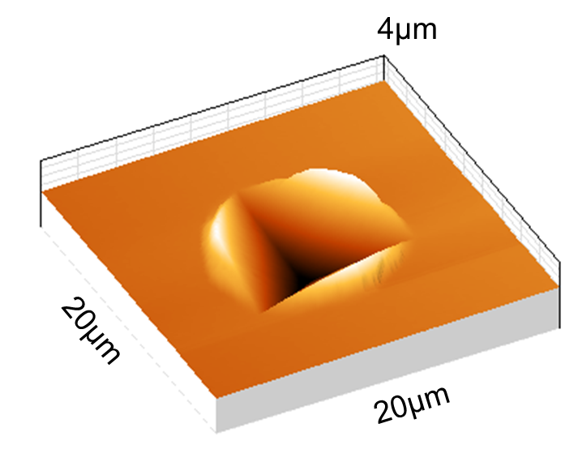
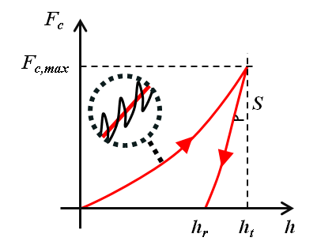
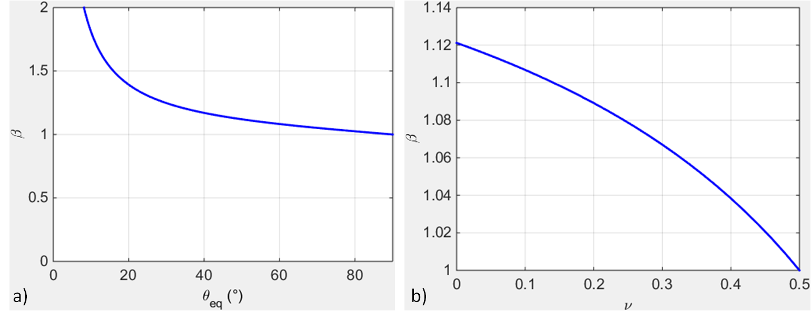
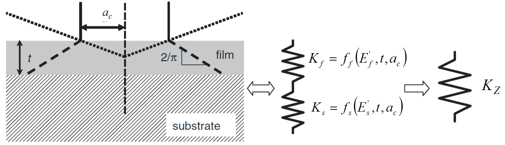
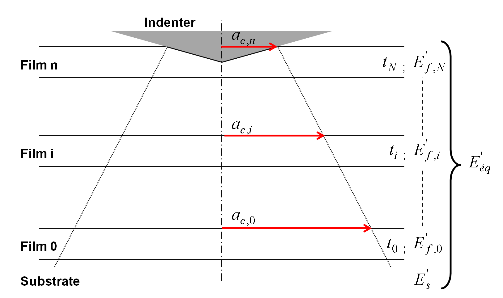
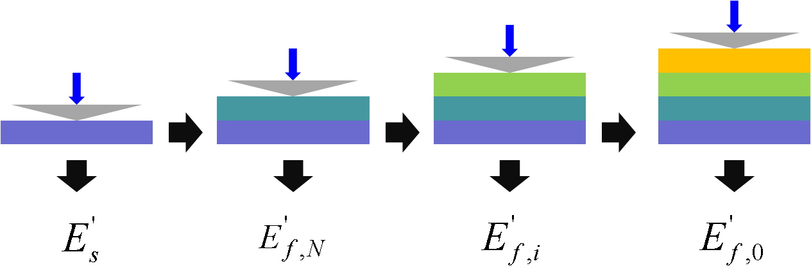
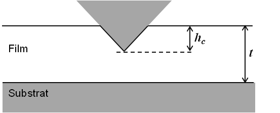
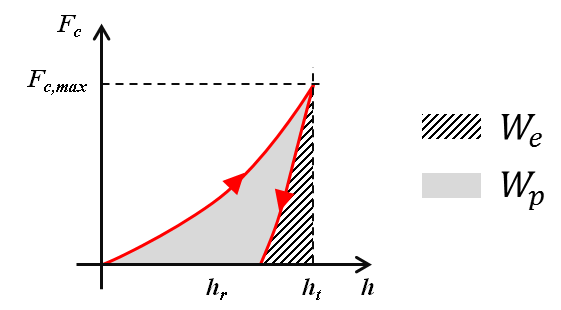

Models
========

.. include:: includes.rst

Nanoindentation tests
#########################

The nanoindentation (or instrumented indentation) is a variety of indentation hardness tests applied to small volumes. 

The following parts give a short overview of models existing in the literature used for the extraction of mechanical properties
of bulk and thin film materials from indentation experiments with conical indenters.

Conical indenters [#Fischer-Cripps_2004]_
-------------------------------------------

.. csv-table:: Table 1 : **Geometric properties of conical indenters.**
   :header: "Indenter", "Berkovich", "Vickers", "Cube-Corner", "Conical"
   :widths: 20,20,20,20,20

   "Shape",                    "3-sided pyramid",   "4-sided pyramid",   "3-sided pyramid",   "Conical (angle :math:`\psi`)"
   "Semi-angle from the apex", "65.3°",             "68°",               "35.2644°",          "--"
   "Equivalent cone angle",    "70.32°",            "70.2996°",          "42.28°",            ":math:`\psi`"  
   "Projected Area",           ":math:`24.56h^2`",  ":math:`24.504h^2`", ":math:`2.5981h^2`", ":math:`\pi{a_\text{c}}^2`"
   "Volume-depth relation",    ":math:`8.1873h^3`", ":math:`8.1681h^3`", ":math:`0.8657h^3`", "--"
   "Projected area/face area", ":math:`0.908`",     ":math:`0.927`",      ":math:`0.5774`",    "--"
   "Contact radius",           "--",                 "--",                 "--",                 ":math:`htan\psi`"

.. figure:: ./_pictures/indenters.png
   :scale: 60 %
   :align: center
   
   *Figure 1 : a) Conical indenter (45°) and b) Berkovich indenter.*
   
Load-Displacement curves
-------------------------

Parameters such as contact load :math:`F_\text{c}` and depth of penetration :math:`h` are recorded during loading and unloading steps of the indentation test.

Loading
+++++++++

A schematic of the load-displacement curve obtained from nanoindentation experiment is given Figure 2.

The evolution of this curve depends on material properties of the sample and the indenter, and of the indenter's geometry.

   
   *Figure 2 : Schematic of indentation load-displacement curve.*

Loubet et al. founded a good fit to the load-displacement data with a power-law relationship of the form [#Loubet_1986]_ :

        .. math:: F_\text{c} = K h_\text{t}^n
                :label: Loubet_load_displacement

With :math:`K` and :math:`n` constants for a given material for a fixed indenter geometry.

Using the load-displacement curves analysis performed by Loubet et al., 
Hainsworth et al. proposed the following relationship to describe load-displacement curves [#Hainsworth_1996]_ :

        .. math:: F_\text{c} = K h_\text{t}^2
                :label: Hainsworth_load_displacement
                
With :math:`K` a constant function of material properties (Young's modulus and hardness) and the indenter.

Unloading
+++++++++++

The slope of unloading curve gives access to the contact stiffness :

    .. math:: S = {dF_\text{c} \over dh}
            :label: stiffness

Pharr and Bolshakov founded that unloading curves were well described by the following power-law relationship [#Pharr_2002]_ :

    .. math:: F_\text{c} = \alpha_\text{u} \left(h_\text{t} - h_\text{r}\right)^m
            :label: unload_displacement

Where :math:`h_\text{r}` is the final displacement after complete unloading, and 
:math:`\alpha_\text{u}` and :math:`m` are material constants. Many experiments performed by 
Pharr and Bolshakov leaded to an average value for :math:`m` close to 1.5 for the Berkovich indenter.
           
Indentation contact topography
-------------------------------

The indentation total depth is rarely equal to the indentation contact depth. Two kind of topography can occur:
    - the pile-up (indentation contact depth > indentation total depth) (see Figure 3-a);
    - the sink-in (indentation contact depth < indentation total depth) (see Figure 3-b).

The flow of material below the indenter is function of mechanical properties of the material.

Pile-up occurs when work-hardening coefficient is low (< 0.3) or if the ratio yield stress
over Young's modulus is less than 1% [#Bolshakov_1998]_, [#Cheng_1998]_ and [#Cheng_2004]_.

   
   *Figure 3 : Schematic of indentation contact topography : a) « pile-up » and b) « sink-in ».*
   

   *Figure 4 : Residual topography of a Berkovich indent in PVD Gold thin film (500nm thick)
   with « pile-up » surrounding the indent, measured by atomic force microscopy.*
   
Three main models defining the depth of contact :math:`h_\text{c}` were developed to take into account this indentation contact topography.

Model of Doerner and Nix [#DoernerNix_1986]_ :
   
    .. math:: h_\text{c} = h_\text{t} - {F_\text{c} \over S}
            :label: doerner_nix_model

Model of Oliver and Pharr [#OliverPharr_1992]_, [#Pharr_2002]_ and [#OliverPharr_2004]_ in case of sink-in:

    .. math:: h_\text{c} = h_\text{t} - \epsilon {F_\text{c} \over S}
            :label: oliver_pharr_model
              
Where :math:`\epsilon` is a function of the indenter's geometry (0.72 for conical indenter,
0.75 for `paraboloids of revolution <https://en.wikipedia.org/wiki/Paraboloid>`_ and 1 for
a flat cylindrical punch). An expression of :math:`\epsilon` in function of the power law
exponent :math:`m` of the unloading curve fit has been proposed by Pharr et Bolshakov [#Pharr_2002]_.

Find here the |matlab| function to plot the :math:`\epsilon` function :
`epsilon_OliverPharr.m <https://github.com/DavidMercier/NIMS/blob/master/Matlab_Code/load_displacement/epsilon_OliverPharr.m>`_.

.. figure:: ./_pictures/epsilonOliverPharr.png
   :scale: 45 %
   :align: center

   *Figure 5 : Evolution of epsilon in function of the power law exponent m of the unloading curve.*

0.72 should be most applicable for a Berkovich indenter, which is more like a cone than a paraboloid of revolution.
But, Oliver and Pharr concluded after a large number of experiments that the best value for the Berkovich indenter is 0.75.

More recently, Merle et al. have found experimentally with indentation test in fused silica,
a value of 0.76 for :math:`\epsilon`, which is in a good agreement with the literature
for a paraboloid of revolution [#Merle_2012]_.

Model of Loubet et al. [#Hochstetter_1999]_, [#Bec_2006]_ in case of pile-up:

    .. math:: h_\text{c} = \alpha \left(h_\text{t} - {F_\text{c} \over S} + h_0\right)
            :label: loubet_model

Where :math:`\alpha` is a constant function of the indented material (usually around 1.2) and the tip-defect :math:`h_0`.

Knowing the depth of contact, it is possible to determine the area of contact
:math:`A_\text{c}` for a perfect conical indenter (with a semi-angle from the apex :math:`\theta`):

    .. math:: A_\text{c} = \pi h_\text{c}^2 tan^2\left(\theta\right)
            :label: area_function_conical

But, because conical indenters present imperfections and Berkovich or Vickers indenters are not perfectly conical,
a general formulae of the contact area has been established by Oliver and Pharr [#OliverPharr_1992]_, [#OliverPharr_2004]_ :

    .. math:: A_\text{c} = C_0 h_\text{c}^2 + \sum_{n=1}^8{C_\text{n} h_\text{c}^{1/2^{n-1}}}
            :label: area_function

With the coefficients :math:`C_0` and :math:`C_\text{n}` obtained by curve fitting procedures,
from nanoindentation experiments in fused silica (amorphous and isotropic material).

For a perfect Berkovich indenter :math:`C_0` is equal to 24.56 and for a perfect Vickers indenter :math:`C_0` is equal to 24.504 (see Table 1).

The second term of the area function :math:`A_\text{c}` describes a paraboloid of revolution, which approximates to a sphere at small penetration depths.
A perfect sphere of radius :math:`R` is defined by the first two terms with :math:`C_0 = -\pi` and :math:`C_1 = 2 \pi R`.
The first two terms also describe a hyperboloid of revolution, a very reasonable shape for a tip-rounded cone or pyramid that approaches
a fixed angle at large distances from the tip.

An equivalent contact radius :math:`a_\text{c}` is also defined based on the area function.

    .. math:: a_\text{c} = \sqrt{A_\text{c} \over \pi}
            :label: contact_radius

One other way to express the function area is that suggested by Loubet et al. [#Loubet_1984]_, 
which describes a pyramid with a small flat region on its tip, the so-called tip defect (:math:`h_0`).
This geometry is described by the addition of a constant to the first two terms in :eq:`area_function`.

Recently, in the paper of Yetna N'jock M. et al. [#YetnaNjock_2015]_, a criterion was proposed
to forecast the behaviour during indentation experiments, following Giannakopoulos and Suresh
methodology [#Giannakopoulos_1999]_. After analyzing either Vickers or Berkovich indentation
tests on a wide range of materials, the following criterion is established :math:`\Delta` :

    .. math:: \Delta = {h_\text{r}^{'} \over h_\text{t}^{'}}
            :label: Yetna_Njock_model

With :math:`h_\text{r}^{'}` and :math:`h_\text{t}^{'}` residual contact depth and maximum depth after applying a compliance correction. Three preponderant deformation modes are distinguished :
    - :math:`\Delta = 0.83` no deformation mode is preponderant;
    - :math:`\Delta < 0.83` implies sink-in formation;
    - :math:`\Delta > 0.83` implies pile-up formation.

Giannakopoulos and Suresh founded a critical value for a similar criterion about 0.875 [#Giannakopoulos_1999]_.

Continuous stiffness measurement [#OliverPharr_1992]_, [#Li_2002]_
--------------------------------------------------------------------

The **Continuous Stiffness Measurement** technique (CSM) consists to calculate the
stiffness continuously during the loading of the indenter. A small dynamic oscillation
is imposed on the force (or displacement) signal and the amplitude and phase of the
corresponding displacement (or force) signal are measured using a frequency-specific amplifier.

   
   *Figure 6 : Schematic of the CSM loading cycle.*

Pharr et al. have highlighted the influence of displacement oscillation on basic measured quantities, like the contact load, the total displacement and the stiffness of the contact [#Pharr_2009]_.
According to the authors, *"the sources of the measurement error have their origin in the relative stiffness of the contact and its relation to the displacements that can be
recovered during the unloading portion of the oscillation"*. Based on that, the authors proposed the following corrections to determine the actual load (:math:`F_\text{c_act}`),
the actual displacement (:math:`h_\text{t_act}`) and the actual stiffness (:math:`S_\text{act}`) :

    .. math:: F_\text{c_act} = F_\text{c} + {\Delta F_\text{c} \over 2} = F_\text{c} + \sqrt{2} \Delta F_\text{c_rms}
            :label: csm_correction_load
            
    .. math:: h_\text{t_act} = h_\text{t} + {\Delta h_\text{t} \over 2} = h_\text{t} + \sqrt{2} \Delta h_\text{t_rms}
            :label: csm_correction_disp
            
    .. math:: S_\text{act} = {1 \over \sqrt{2\pi}} \left({1 \over K}\right)^{1 \over m} \left[1-\left(1-S{{2\sqrt{2} \Delta h_\text{t_rms}} \over {F_\text{c_max}}}\right)^{1 \over m}\right]{F_\text{c_max} \over {\Delta h_\text{t_rms}}}
            :label: csm_correction_stiffness
            
With :math:`K` and :math:`m` constants determined from unloading curves. These constants are related by the following equation :

    .. math:: K = \left({2 \over ^{m\sqrt{2\pi}}}\right)^m
            :label: csm_K_m

Pharr and Bolshakov founded a value of 1.380 for :math:`m` after many Berkovich indentation tests on a variety of materials [#Pharr_2002]_.
Thus, a value of 0.757 is used for the constant :math:`K`, using :eq:`csm_K_m`.
 
Extraction of elastic properties
##################################################

Elastic properties of bulk material
---------------------------------------

Bulychev et al. [#Bulychev_1973]_ and Shorshorov M. K. et al. [#Shorshorov_1982]_ were the first to determine
the reduced Young's modulus of a material with the relationships established by Love [#Love_1939]_, Galin [#Galin_1946]_
and Sneddon [#Sneddon_1948]_, between the applied load and the displacement during an indentation test of an elastic material.

They proposed to expressed the reduced Young's modulus in function of the contact area and the contact stiffness :

    .. math:: E^{*} = {1 \over 2} \sqrt{\pi \over A} S
            :label: experimental_youngs_modulus

Then, Oliver and Pharr [#Pharr_1992]_, [#OliverPharr_1992]_ democratized this formulae
after introducing a correction factor identified by King [#King_1987]_ :

    .. math:: E^{*} = {1 \over {2\beta}} \sqrt{\pi \over A} S
            :label: experimental_youngs_modulus_OP

With :math:`\beta` a geometrical correction factor equal to :
    - 1 for circular indenters (e.g.: conical and spherical indenter);
    - 1.034 for three-sided pyramid indenters (e.g.: Berkovich indenter);
    - 1.012 for four-sided pyramid indenters (e.g.: Vickers indenter).

Woirgard has demonstrated analytically that the exact value of :math:`\beta` 
for the perfectly sharp Berkovich indenter should be 1.062 [#Troyon_2006]_.

Some authors proposed another correction factor function of the angle of the conical
indenter and the Poisson's ratio of the indented material [#Hay_1999]_ and [#Strader_2006]_.
For a conical indenter with an half-angle of :math:`\gamma \leq 60°`
(e.g.: Cube-Corner indenter), the analytical approximation is :

    .. math:: \beta = 1 + {{\left(1-2\nu\right)} \over {4\left(1-\nu\right)tan\gamma}}
            :label: gamma_low_angle

For a conical indenter with larger half-angle (e.g.: Berkovich indenter), the analytical approximation is :
            
    .. math:: \beta = \pi{ {\pi/4 + 0.1548cot\gamma{{1-2\nu} \over {4\left(1-\nu\right)}}} \over {\left[\pi/2-0.8311cot\gamma{{1-2\nu} \over {4\left(1-\nu\right)}}\right]^2}}
            :label: gamma_high_angle

With :math:`\nu` the Poisson's ratio of the indented material.

Find here the |matlab| function to plot the :math:`\beta` function of Hay et al.:
`beta_Hay.m <https://github.com/DavidMercier/NIMS/blob/master/Matlab_Code/elastic_models/beta_Hay.m>`_.

   
   *Figure 7 : Plots of beta Hay : a) in function of the half-angle of the conical indenter (for a Poisson's ratio of 0.3), and b) in function of the Poisson's ratio for a Berkovich indenter.*

Knowing the material properties of the indenter, it is possible to calculate
the reduced Young's modulus of the indented material. 

    .. math:: {1 \over E^{'}} = {1 \over E^{*}} - {1 \over E_\text{i}^{'}}
            :label: youngs_modulus
            
    .. math:: E = E^{'} \left(1-\nu^{2}\right)
            :label: reduced_youngs_modulus

    .. math:: E_\text{i}^{'} = {E_\text{i} \over \left(1-\nu_\text{i}^{2}\right)}
            :label: indenter_reduced_youngs_modulus

With :math:`\nu` the Poisson's ratio of the indented material and :math:`\nu_\text{i}`
the Poisson's ratio of the material of the indenter.

.. note::
    This method used to analyze indentation data is based on equations valid for
    isotropic homogeneous elastic solids.

.. note::
    Indenters are mainly in diamond. Diamond has a Young's modulus of 1070GPa
    and a Poisson's ratio of 0.07 [#Fischer-Cripps_2004]_.

Elastic properties of a thin film on a substrate
----------------------------------------------------

For indentation test on a multilayer sample (thin films deposited on a substrate for example),
the calculated composite reduced modulus :math:`E^{'}` with previous models, can generally be expressed as
a combination of the respective reduced moduli of the films, :math:`E^{'}_\text{f}`, and of the substrate, :math:`E^{'}_\text{s}`.

If the films moduli differs from that of the substrate, then :math:`E^{'}` changes
with the depth of penetration :math:`h`. The evolution of the composite modulus :math:`E^{'}` is 
function of the material properties of the materials, the thickness :math:`t` and the density of the thin films and 
the properties and the geometry of the indenter.

If the characterized film is thick enough, it is possible to extract the elastic properties
for indentation depth lower than 10% of the film thickness (:math:`h \leq 10% t`) [#Bückle_1961]_.

Because of the imperfections of the indenters, the roughness and the surface pollution, it is more or less meaningful
to use this rule of the 10%, for film thicker than 500nm.

Several models to analyze bilayer sample indentation and to extract intrinsic
material properties of the film from are detailed in the following part.

Menčík et al. proposed the following structures to express the combination of :math:`E^{'}_\text{f}` and :math:`E^{'}_\text{s}` [#Menčík_1997]_.
         
    .. math:: E^{'} = E^{'}_\text{s} + \left(E^{'}_\text{f} - E^{'}_\text{s}\right) \phi\left(x\right)
            :label: youngs_modulus_evolution_phi

    .. math:: E^{'} = E^{'}_\text{s} + \left(E^{'}_\text{f} - E^{'}_\text{s}\right) \psi\left(x\right)
            :label: youngs_modulus_evolution_psi
            
Where :math:`x` is the ratio of the contact radius (:math:`a_\text{c}`) or the
contact depth (:math:`h_\text{c}`), to the film thickness (:math:`t`), and 
:math:`\phi` and :math:`\psi` are weight functions of the relative penetration :math:`x`.
:math:`\phi` is equal to 1 when :math:`x` is equal to 0 and 0 when :math:`x` is infinite.
           
.. note::
    If the difference between Poisson’s ratio of the thin film and substrate is small, the values for uniaxial loading Young's moduli, 
    :math:`E`, :math:`E_\text{f}`, :math:`E_\text{s}` can be used in previous equation.

Doerner and Nix (1986) [#DoernerNix_1986]_, [#King_1987]_ and [#Saha_2002]_
++++++++++++++++++++++++++++++++++++++++++++++++++++++++++++++++++++++++++++

    .. math:: {1 \over E^{'}} = {1 \over E_\text{f}^{'}} + \left({1 \over E_\text{s}^{'}} - {1 \over E_\text{f}^{'}}\right) e^{-\alpha\left(x\right)}
            :label: doerner_nix

With :math:`x=t/h` and :math:`\alpha` is an empirically constant determined using the method of least squares.

The equation was modified by King (1987), by the replacement of :math:`t/h` by :math:`t/a_\text{c}`.

Find here the |matlab| function for the Doerner and Nix function :
`model_doerner_nix_king.m <https://github.com/DavidMercier/NIMS/blob/master/Matlab_Code/elastic_models/model_doerner_nix_king.m>`_.

Gao et al. (1992) [#Gao_1992]_
+++++++++++++++++++++++++++++++++

    .. math:: E^{'} = E^{'}_\text{s} + \left(E^{'}_\text{f} - E^{'}_\text{s}\right) \phi_{Gao_0}\left(x\right)
            :label: gao

    .. math:: \phi_{Gao_0} = {2 \over \pi} arctan {1 \over x} + {1 \over {2\pi\left(1-\nu_\text{c}\right)}} \left[\left(1-2\nu_\text{c}\right){1 \over x}ln \left(1 + x^2 \right) - {x \over {1+x^2}}\right]
            :label: phi_gao_0

    .. math:: \nu_{c} = 1 + \left[{{\left(1-\nu_\text{s}\right)\left(1-\nu_\text{f}\right)} \over {1-\left(1-\phi_{Gao_1}\right)\nu_\text{f}-\phi_{Gao_1}\nu_\text{s}}}\right]
            :label: poisson_ratio_composite

With :math:`\nu_{c}` the composite Poisson's ratio, :math:`\nu_{s}` the Poisson's ratio of the substrate and :math:`\nu_{f}` the Poisson's ratio of the thin film.

    .. math:: \phi_{Gao_1} = {2 \over \pi} arctan {1 \over x} + {1 \over {x\pi}}ln \left(1+x^2 \right)
            :label: phi_gao_1

With :math:`x=a_\text{c}/t`.

Find here the |matlab| function for the Gao et al. function :
`model_gao.m <https://github.com/DavidMercier/NIMS/blob/master/Matlab_Code/elastic_models/model_gao.m>`_.

Menčík et al. (linear model) (1997) [#Menčík_1997]_
+++++++++++++++++++++++++++++++++++++++++++++++++++++

    .. math:: E^{'} = E^{'}_\text{f} + \left(E^{'}_\text{s} - E^{'}_\text{f}\right)\left(x\right)
            :label: mencik_linear

With :math:`x=a_\text{c}/t`.

Find here the |matlab| function for the Menčík et al. linear function :
`model_menick_linear.m <https://github.com/DavidMercier/NIMS/blob/master/Matlab_Code/elastic_models/model_mencik_linear.m>`_.

Menčík et al. (exponential model) (1997) [#Menčík_1997]_
++++++++++++++++++++++++++++++++++++++++++++++++++++++++++

    .. math:: E^{'} = E^{'}_\text{s} + \left(E^{'}_\text{f} - E^{'}_\text{s}\right) e^{-\alpha\left(x\right)}
            :label: mencik_exponential

With :math:`x=a_\text{c}/t` and :math:`\alpha` is an empirically constant determined using the method of least squares.

Find here the |matlab| function for the Menčík et al. exponential function :
`model_menick_exponential.m <https://github.com/DavidMercier/NIMS/blob/master/Matlab_Code/elastic_models/model_mencik_exponential.m>`_.

Menčík et al. (reciprocal exponential model) (1997) [#Menčík_1997]_
+++++++++++++++++++++++++++++++++++++++++++++++++++++++++++++++++++++++

    .. math:: {1 \over E^{'}} = {1 \over E_\text{s}^{'}} + \left({1 \over E_\text{f}^{'}} - {1 \over E_\text{s}^{'}}\right) e^{-\alpha\left(x\right)}
            :label: mencik_reciprocal_exponential

With :math:`x=a_\text{c}/t` and :math:`\alpha` is an empirically constant determined using the method of least squares.

Find here the |matlab| function for the Menčík et al. reciprocal exponential function :
`model_menick_reciprocal_exponential.m <https://github.com/DavidMercier/NIMS/blob/master/Matlab_Code/elastic_models/model_mencik_reciprocal_exponential.m>`_.

Perriot et al. (2003) [#Perriot_2004]_
+++++++++++++++++++++++++++++++++++++++++

    .. math:: E^{'} = E^{'}_\text{f} + {{E^{'}_\text{s}-E^{'}_\text{f}} \over 1+\left({{k_0} \over x}\right)^n}
            :label: perriot_barthel

    .. math:: log(k_0) = -0.093+0.792log\left({E^{'}_\text{s} \over E^{'}_\text{f}}\right) + 0.05\left[log{E^{'}_\text{s} \over E^{'}_\text{f}}\right]^2
            :label: perriot_barthel_k0

With :math:`x=a_\text{c}/t`, and :math:`k_0` and :math:`n` are adjustable constants determined using the method of least squares.

Find here the |matlab| function for the Perriot et al. function :
`model_perriot_barthel.m <https://github.com/DavidMercier/NIMS/blob/master/Matlab_Code/elastic_models/model_perriot_barthel.m>`_.

Bec et al. (2006) [#Bec_2006]_
+++++++++++++++++++++++++++++++++

This elastic model is based on indentation by a rigid cylindrical punch (radius :math:`a_\text{c}`)
of a homogeneous film deposited on a semi-infinite half space.

This system is modelled by two springs connected in series (see Figure 8).

   
   *Figure 8 : Schematic description of the bilayer model of Bec et al. .*

    .. math:: K_\text{f} = \pi a_\text{c}^2 {E^{'}_\text{f} \over t}
            :label: bec_kf
            
    .. math:: K_\text{s} = 2 a_\text{c} E^{'}_\text{s}
            :label: bec_ks

    .. math:: K_\text{z} = 2 a_\text{c} E^{'}
            :label: bec_kz
                       
    .. math:: {1 \over K_\text{z}} = {1 \over {f_\text{f}\left(a_\text{c}\right) K_\text{f}}} + {1 \over {f_\text{s}\left(a_\text{c}\right)K_\text{s}}}
            :label: bec_sum_kf_ks

    .. math:: f_\text{f}\left(a_\text{c}\right) = f_\text{s}\left(a_\text{c}\right) = 1 + {{2t} \over {\pi a_\text{c}}}
            :label: bec_f_ac
            
    .. math:: {1 \over {2 a_\text{c} E^{'}}} = {t \over {\left(\pi a_\text{c}^2 + 2ta_\text{c}\right)E^{'}_\text{f}}} + {1 \over {2\left(a_\text{c} + {2t \over \pi}\right)E^{'}_\text{s}}}
            :label: bec_Eeq

Find here the |matlab| function for the Bec et al. function :
`model_bec.m <https://github.com/DavidMercier/NIMS/blob/master/Matlab_Code/elastic_models/model_bec.m>`_.
            
Hay et al. (2011) [#Hay_2011]_
++++++++++++++++++++++++++++++++++

The present model is a development of the Song–Pharr model [#Rar_2002]_ and [#Xu_2006]_ , which is already inspired by the Gao model [#Gao_1992]_.

    .. math:: {1 \over \mu_\text{c}} = \left(1-\phi_{Gao_0}\right) {1 \over {\mu_\text{s} + F\phi_{Gao_0}\mu_\text{f}}} + \phi_{Gao_0}{1 \over \mu_\text{f}}
            :label: hay_model
            
Where :math:`\mu_\text{c}` is the composite shear modulus calculated from the composite Young’s modulus as :

    .. math:: \mu_\text{c} = {E \over {2\left(1+\nu_\text{c}\right)}}
            :label: hay_muc
            
Where :math:`\nu_\text{c}` is the composite Poisson's ratio given in Gao's model.

    .. math:: E = \left(1 - \nu_\text{c}^2\right)E^{'}
            :label: hay_Ec

Knowing :math:`\mu_\text{c}`, it is possible to calculate :math:`\mu_\text{f}` :

    .. math:: \mu_\text{f} = {{-B + \sqrt{B^2-4AC}} \over {2A}}
            :label: hay_muf
            
Where :math:`A = F \phi_{Gao_0}`
            
    .. math:: B = \mu_\text{s} - \left(F \phi_{Gao_0}^2 - \phi_{Gao_0} + 1\right)\mu_\text{c}
            :label: hay_B

With :math:`F = 0.0626`, a constant obtained from finite element simulations.
            
    .. math:: C = -\phi_{Gao_0}\mu_\text{c}\mu_\text{s}
            :label: hay_C
            
    .. math:: \mu_\text{s} = {E_\text{s} \over {2\left(1+\nu_\text{s}\right)}}
            :label: hay_mus
            
Finally, the Young’s modulus of the film is calculated from the shear modulus and Poisson’s ratio of the film :

    .. math:: E_\text{f} = 2\mu_\text{f}\left(1 + \nu_\text{f}\right)
            :label: hay_Ef

Find here the |matlab| function for the Hay et al. function :
`model_hay.m <https://github.com/DavidMercier/NIMS/blob/master/Matlab_Code/elastic_models/model_hay.m>`_.
            
Elastic properties of a thin film on a multilayer system
----------------------------------------------------------

Mercier et al. (2010) [#Mercier_2010]_
++++++++++++++++++++++++++++++++++++++++

The elastic model of Mercier et al. for a multilayer sample on :math:`N+1` layers is an extension of the Bec et al. model.
                      
    .. math:: {1 \over {2 a_{\text{c},0} E^{'}}} = \sum_{i=0}^{N} {t_i \over {\left(\pi a_{\text{c},i}^2 + 2t_ia_{\text{c},i}\right)E^{'}_{\text{f},i}}} + {1 \over {2\left(a_{\text{c},N} + {2t_N \over \pi}\right)E^{'}_\text{s}}}
            :label: mercier_Eeq
            
    .. math:: a_{\text{c},i+1} = a_{\text{c},i} + {2t \over \pi}
            :label: mercier_ac
            
With :math:`a_{\text{c},0}` equal to :math:`a_{\text{c}}`.

Thus, the Young’s modulus of the film can be calculated as :

    .. math:: E^{'}_{\text{f},0} = \left[{{\pi a_{\text{c},0}^2 + 2t_0a_{\text{c},0}} \over t_0} \left[{1 \over {2 a_{\text{c},0} E^{'}}} - {\left(\sum_{i=1}^{N} {{t_i \over {\left(\pi a_{\text{c},i}^2 + 2t_ia_{\text{c},i}\right)E^{'}_{\text{f},i}}} + {1 \over {2\left(a_{\text{c},N}+ {2t_N \over \pi}\right)E^{'}_\text{s}}}}\right)}\right]\right]^{-1}
            :label: mercier_Ef

   
   *Figure 9 : Schematic of elastic multilayer model.*
   

   
   *Figure 10 : Experimental process to apply for elastic multilayer model.*

Find here the |matlab| function for the Mercier et al. function :
`model_multilayer_elastic.m <https://github.com/DavidMercier/NIMS/blob/master/Matlab_Code/elastic_models/model_multilayer_elastic.m>`_.
  
Corrections to apply for thin film indentation [#Menčík_1997]_, [#Saha_2002]_, [#Bec_2006]_ and [#Li_2010]_
--------------------------------------------------------------------------------------------------------------------

During nanoindentation tests of thin film on substrate, the thickness of the film beneath the indenter is smaller than
its original value, because of plastic flow during loading. The use of the original film thickness :math:`t` in
the regression model cause a systematic shift or distortion of the Young's modulus curve.
A correction proposed by Menčík et al. can be apply, assuming a rigid substrate and determining the effective thickness :math:`t_{eff}`.

    .. math:: \pi a^2 t_\text{eff} = \pi a^2 t - V
            :label: general_thickness_correction

With :math:`V` the volume displaced by the indenter and approximated by :math:`\pi a^2 h_\text{c} / 3`, 
for a conical indenter and contact depths :math:`h_\text{c}` smaller than the film thickness.

    .. math:: t_\text{eff} = t - {h_\text{c} \over 3}
            :label: thickness_correction

   
   *Figure 11 : Indentation penetration of a thin film on a sample.*
   
Recently, Li et al. proposed to express the local thinning effect as [#Li_2010]_:

    .. math:: t_\text{eff} = t - \eta h_\text{c}
            :label: thickness_correction_Li

With :math:`\eta` a parameter depending on the mechanical properties of the film and
the substrate, and on the geometry of the indenter. Preliminary finite element calculations show that
:math:`\eta` should be independent of indentation depth and that its value ranges from
0.3 to 0.7 for materials that do not work harden.

Extraction of plastic properties [#OliverPharr_1992]_
------------------------------------------------------

    .. math:: H = {F_\text{c,max} \over A_\text{c}}
            :label: hardness
            
Energy approach
----------------

Another way to access indentation data is the use of the energy dissipated during the indentation.
The elastic and plastic energies are based on the integral of the loading and unloading curve
(see Figure 12) [#ChengCheng_1998]_ and [#Malzbender_2002]_.

   *Figure 12 : Schematic representation of indentation load–displacement curves with definition of different works of indentation.*

    .. math:: W_\text{tot} = \int_{0}^{h_\text{t}} {F_\text{c}\left(dh\right)}
            :label: energy_tot
            
    .. math:: W_\text{e} = \int_{h_\text{r}}^{h_\text{t}} {F_\text{c}\left(dh\right)}
            :label: energy_elastic
            
    .. math:: W_\text{p} = W_\text{tot} - W_\text{e}
            :label: energy_plastic
            
Methodology to extract properties without the function area [#OliverPharr_2004]_
-----------------------------------------------------------------------------------

The ratio of the irreversible work :math:`W_\text{tot} - W_\text{e}` to the total work :math:`W_\text{tot}`,
appears to be a unique function of the Young's modulus and the hardness of the material,
independent of the work-hardening behavior [#ChengCheng_1998]_.

    .. math:: {{W_\text{tot} - W_\text{e}} \over W_\text{tot}} = 1 - 5{H \over E^{'}}
            :label: energy_ratio

Then, combining the expression of the reduced Young's modulus :eq:`experimental_youngs_modulus_OP`
with the expression of the hardness :eq:`hardness`, leads to the following equation :

    .. math:: {4 \over \pi} {F_\text{c,max} \over S^2} = {H \over E^{'}}
            :label: P_squareS
            
These two last equations represent two independent relations that can be solved for :math:`H` and :math:`E^{'}` in
a manner that does not directly involve the contact area.

The equation :eq:`P_squareS` is used as well to determine coefficients of the function area :eq:`area_function`.
Based on the assumption that the hardness and the Young's modulus remain constant during indentation test in fused silica (isotropic material),
the evolution of the ratio :math:`{F_\text{c,max} \over S^2}` should stay constant as well in function of the indentation depth.

More recently, Guillonneau et al. proposed a model to extract mechanical properties without using
the indentation depth [#Guillonneau_2012_1]_ and [#Guillonneau_2012_2]_.
The method is based on the detection of the second harmonic for dynamic indentation testing.
This model is interesting especially for penetration depths in the range of 25 to 100nm, where the
uncertainties related to the displacement measurement disturb a lot.

References
-----------

.. [#Bec_2006] `Bec S. et al., "Improvements in the indentation method with a surface force apparatus" (2006). <http://dx.doi.org/10.1080/01418619608239707>`_
.. [#Bückle_1961] Bückle H., "VDI Berichte" (1961).
.. [#Bulychev_1973] Bulychev S.I. et al., “Determining Young’s modulus from the indentor penetration diagram.”, Zavod. Lab., 1973, 39, pp. 1137-1142.
.. [#Bolshakov_1998] `Bolshakov A. and Pharr G.M., "Influences of pile-up on the measurement of mechanical properties by load and depth sensing indentation techniques." (1998) <http://dx.doi.org/10.1557/JMR.1998.0146>`_
.. [#Cheng_1998] `Cheng Y.T. and Cheng C.M. ,"Effects of ‘sinking in’ and ‘piling up’ on estimating the contact area under load in indentation." (1998) <http://dx.doi.org/10.1080/095008398178093>`_
.. [#ChengCheng_1998] `Cheng Y.T. and Cheng C.M. ,"Relationships between hardness, elastic modulus, and the work of indentation." (1998) <http://dx.doi.org/10.1063/1.121873>`_
.. [#Cheng_2004] `Cheng Y.T. and Cheng C.M., "Scaling, dimensional analysis, and indentation measurements." (2004) <http://dx.doi.org/10.1016/j.mser.2004.05.001>`_
.. [#DoernerNix_1986] `Doerner M.F. and Nix W.D., "A method for interpreting the data from depth-sensing indentation instruments" (1986). <http://dx.doi.org/10.1557/JMR.1986.0601>`_
.. [#Fischer-Cripps_2004] `Fischer-Cripps A.C., "Nanoindentation" Springer 2nd ed. (2004). <http://dx.doi.org/10.1007/978-1-4419-9872-9>`_
.. [#Galin_1946] Galin L.A., "Spatial contact problems of the theory of elasticity for punches of circular shape in planar projection.", J. Appl. Math. Mech. (PMM) (1946), 10, pp. 425-448.
.. [#Gao_1992] `Gao H. et al., "Elastic contact versus indentation modeling of multi-layered materials" (1992). <http://dx.doi.org/10.1016/0020-7683(92)90004-D>`_
.. [#Giannakopoulos_1999] `Giannakopoulos A.E. and Suresh S., "Determination of elastoplastic properties by instrumented sharp indentation.", Scripta Materialia (1999). <http://dx.doi.org/10.1016/S1359-6462(99)00011-1>`_
.. [#Guillonneau_2012_1] `Guillonneau G. et al.,"Extraction of mechanical properties with second harmonic detection for dynamic nanoindentation testing.", Experimental Mechanics (2012). <http://dx.doi.org/10.1007/s11340-011-9561-5>`_
.. [#Guillonneau_2012_2] `Guillonneau G. et al.,"Determination of mechanical properties by nanoindentation independently of indentation depth measurement.", J. Mater. Res. (2012). <http://dx.doi.org/10.1557/jmr.2012.261>`_
.. [#Hainsworth_1996] `Hainsworth S.V. et al., "Analysis of nanoindentation load-displacement loading curves." J. Mater. Res. (1996). <http://dx.doi.org/10.1557/JMR.1996.0250>`_
.. [#Hay_1999] `Hay J.C. et al., "A critical examination of the fundamental relations used in the analysis of nanoindentation data." J. Mater. Res. (1999). <http://dx.doi.org/10.1557/JMR.1999.0306>`_
.. [#Hay_2011] `Hay J. and Crawford B., "Measuring substrate-independent modulus of thin films" (2011). <http://dx.doi.org/10.1557/jmr.2011.8>`_
.. [#Hochstetter_1999] `Hochstetter G. et al., "Strain-rate effects on hardness of glassy polymers in the nanoscale range. Comparison between quasi-static and continuous stiffness measurements" (1999). <http://dx.doi.org/10.1080/00222349908248131>`_
.. [#King_1987] `King R.B., "Elastic analysis of some punch problems for a layered medium" (1987). <http://dx.doi.org/10.1016/0020-7683(87)90116-8>`_
.. [#Li_2002] `Li X. and Bhushan B., "A review of nanoindentation continuous stiffness measurement technique and its applications.", Mater. Characterization, 2002. <http://dx.doi.org/10.1016/S1044-5803(02)00192-4>`_
.. [#Li_2010] `Li H. et al., "New methods of analyzing indentation experiments on very thin films" (2010). <http://dx.doi.org/10.1557/JMR.2010.0095>`_
.. [#Loubet_1984] `Loubet J.L. et al., "Vickers Indentation Curves of Magnesium Oxide (MgO).", J. Tribol. (1984) <http://dx.doi.org/10.1115/1.3260865>`_
.. [#Loubet_1986] `Loubet J.L. et al., "Vickers indentation curves of elastoplastic materials." Microindentation Techniques in Materials Science and Engineering (1986). <http://dx.doi.org/10.1520/STP889-EB>`_
.. [#Love_1939] `Love A. E. H., "Boussinesq’s problem for a rigid cone.", The Quarterly J. of Mathematics (1939). <http://dx.doi.org/10.1093/qmath/os-10.1.161>`_
.. [#Malzbender_2002] `Malzbender J. and de With G., "Indentation load–displacement curve, plastic deformation, and energy.", J. Mater. Res. (2002). <http://dx.doi.org/10.1557/JMR.2002.0070>`_
.. [#Menčík_1997] `Menčík J. et al., "Determination of elastic modulus of thin layers using nanoindentation" (1997). <http://dx.doi.org/10.1557/JMR.1997.0327>`_
.. [#Mercier_2010] `Mercier D. et al., "Mesure de module d'Young d'un film mince à partir de mesures expérimentales de nanoindentation réalisées sur des systèmes multicouches" (2010). <http://dx.doi.org/10.1051/mattech/2011029>`_
.. [#Merle_2012] `Merle B. et al., "Experimental determination of the effective indenter shape and e-factor for nanoindentation by continuously measuring the unloading stiffness.", J. Mater. Res. (2012). <http://dx.doi.org/10.1557/jmr.2011.245>`_
.. [#OliverPharr_1992] `Oliver W.C. and Pharr G.M., "An improved technique for determining hardness and elastic modulus using load and displacement sensing indentation experiments" (1992). <http://dx.doi.org/10.1557/JMR.1992.1564>`_
.. [#OliverPharr_2004] `Oliver W.C. and Pharr G.M., "Measurement of hardness and elastic modulus by instrumented indentation: Advances in understanding and refinements to methodology" (2004). <http://dx.doi.org/10.1557/jmr.2004.19.1.3>`_
.. [#Perriot_2004] `Perriot A. and Barthel E., "Elastic contact to a coated half-space: Effective elastic modulus and real penetration" (2004). <http://dx.doi.org/10.1557/jmr.2004.19.2.600>`_
.. [#Pharr_1992] `Pharr G.M. et al., "On the generality of the relationship among contact stiffness, contact area, and elastic modulus during indentation." (1992). <http://dx.doi.org/10.1557/JMR.1992.0613>`_
.. [#Pharr_2002] `Pharr G.M. and Bolshakov A., "Understanding nanoindentation unloading curves." J. Mater. Res. (2002). <http://dx.doi.org/10.1557/JMR.2002.0386>`_
.. [#Pharr_2009] `Pharr G.M. et al., "Critical issues in making small-depth mechanical property measurements by nanoindentation with continuous stiffness measurement" (2009). <http://dx.doi.org/10.1557/jmr.2009.0096>`_
.. [#Rar_2002] `Rar A. et al., "Assessment of new relation for the elastic compliance of a film–substrate system.", Thin Films: Stresses and Mechanical Properties IX (2002). <http://dx.doi.org/10.1557/PROC-695-L10.10.1>`_ 
.. [#Saha_2002] `Saha R. and Nix W.D., "Effects of the substrate on the determination of thin film mechanical properties by nanoindentation" (2002). <http://dx.doi.org/10.1016/S1359-6454(01)00328-7>`_
.. [#Sneddon_1948] `Sneddon I.N., "Boussinesqs problem for a rigid cone.", Proc. of the Cambridge Philosophical Soc. (1948). <http://dx.doi.org/10.1017/S0305004100024518>`_
.. [#Shorshorov_1982] Shorshorov M.K. et al., Sov. Phys. Dokl., 1982, 26.
.. [#Strader_2006] `Strader J.H. et al., "An experimental evaluation of the constant b relating the contact stiffness to the contact area in nanoindentation.", Philosophical Magazine (2006) <http://dx.doi.org/10.1080/14786430600567747>`_
.. [#Troyon_2006] `Troyon M. and Lafaye S., "About the importance of introducing a correction factor in the Sneddon relationship for nanoindentation measurements" (2002). <http://dx.doi.org/10.1080/14786430600606834>`_
.. [#Xu_2006] `Xu H. and Pharr G.M., "An improved relation for the effective elastic compliance of a film/substrate system during indentation by a flat cylindrical punch.", Scr. Mater. (2006). <http://dx.doi.org/10.1016/j.scriptamat.2006.04.037>`_
.. [#YetnaNjock_2015] `Yetna N'jock M. et al., "A criterion to identify sinking-in and piling-up in indentation of materials.", International Journal of Mechanical Sciences (2015). <http://dx.doi.org/10.1016/j.ijmecsci.2014.11.008>`_
