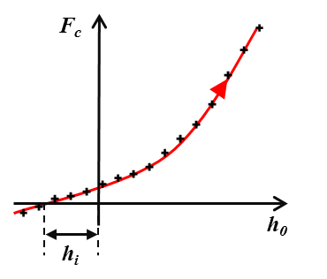
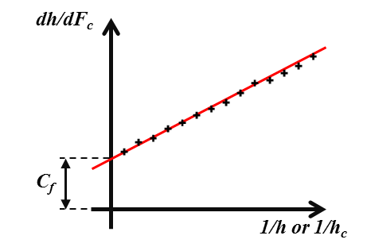
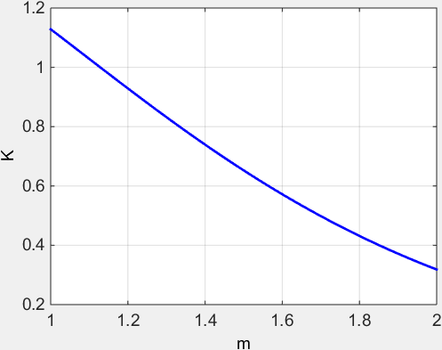

Models for bulk material
==========================

.. include:: includes.rst

The nanoindentation (or instrumented or depth sensing indentation) is a variety
of indentation hardness tests applied to small volumes. During nanoindentation,
an indenter is brought into contact with a sample and mechanically loaded.

The following parts give a short overview of models existing in the
literature used for the extraction of mechanical properties of homogeneous 
bulk materials from indentation experiments with conical (sharp) indenters.

Please look at the ISO standard (ISO 14577 - 1 to 3), to perform nanoindentation tests on bulk material.

- `ISO 14577 - 1 , "Metallic materials -- Instrumented indentation test for hardness and materials parameters -- Part 1: Test method", (2002). <http://www.iso.org/iso/home/store/catalogue_tc/catalogue_detail.htm?csnumber=30104>`_

- `ISO 14577 - 2 , "Metallic materials -- Instrumented indentation test for hardness and materials parameters -- Part 2: Verification and calibration of testing machines", (2002). <http://www.iso.org/iso/home/store/catalogue_tc/catalogue_detail.htm?csnumber=30543>`_

- `ISO 14577 - 3 , "Metallic materials -- Instrumented indentation test for hardness and materials parameters -- Part 3: Calibration of reference blocks", (2002). <http://www.iso.org/iso/home/store/catalogue_tc/catalogue_detail.htm?csnumber=32193>`_

Some authors reviewed already the nanoindentation technique :

- `Li X. and Bhushan B., "A review of nanoindentation continuous stiffness measurement technique and its applications." (2002). <http://dx.doi.org/10.1016/S1044-5803(02)00192-4>`_

- `VanLandingham M.R., "Review of Instrumented Indentation" (2003). <http://oai.dtic.mil/oai/oai?verb=getRecord&metadataPrefix=html&identifier=ADA512140>`_

- `Fischer-Cripps A.C., "Nanoindentation" Springer 2nd ed. (2004). <http://dx.doi.org/10.1007/978-1-4419-9872-9>`_

- `Oliver W.C. and Pharr G.M., "Measurement of hardness and elastic modulus by instrumented indentation: Advances in understanding and refinements to methodology" (2004). <http://dx.doi.org/10.1557/jmr.2004.19.1.3>`_

- `Fischer-Cripps A.C., "Critical review of analysis and interpretation of nanoindentation test data" (2006). <http://dx.doi.org/10.1016/j.surfcoat.2005.03.018>`_

- `Lucca D.A. et al., "Nanoindentation: Measuring methods and applications" (2012). <http://dx.doi.org/10.1016/j.cirp.2010.05.009>`_

- `Němeček J., "Nanoindentation in Material Science" (2012). <http://dx.doi.org/10.5772/2829>`_

Nanoindentation tests on bulk material
########################################

Conical indenters 
------------------

The geometric properties of conical indenters are well described in [#Fischer-Cripps_2004]_.

.. csv-table:: Table 1 : **Geometric properties of conical indenters.**
   :header: "Indenter", "Berkovich", "Vickers", "Cube-Corner", "Conical"
   :widths: 20,20,20,20,20

   "Shape",                    "3-sided pyramid",   "4-sided pyramid",   "3-sided pyramid",   "Conical (angle :math:`\psi`)"
   "Semi-angle from the apex", "65.3°",             "68°",               "35.2644°",          "--"
   "Equivalent cone angle",    "70.32°",            "70.2996°",          "42.28°",            ":math:`\psi`"  
   "Projected Area",           ":math:`24.56h^2`",  ":math:`24.504h^2`", ":math:`2.5981h^2`", ":math:`\pi{a_\text{c}}^2`"
   "Volume-depth relation",    ":math:`8.1873h^3`", ":math:`8.1681h^3`", ":math:`0.8657h^3`", "--"
   "Projected area/face area", ":math:`0.908`",     ":math:`0.927`",     ":math:`0.5774`",    "--"
   "Contact radius",           "--",                "--",                "--",                ":math:`htan\psi`"

.. figure:: ./_pictures/indenters.png
   :scale: 60 %
   :align: center

   *Figure 1 : a) Conical indenter (45°) and b) Berkovich indenter.*

These indenters have self-similar geometries which implies a constant strain
and similarity of the stress fields.

.. note::
    Indenters are mainly in diamond. Diamond has a Young's modulus of 1070GPa
    and a Poisson's ratio of 0.07 [#Fischer-Cripps_2004]_.
   
Load-Displacement curves
---------------------------

In this first part, only quasistatic nanoindentation is considered, when a load is applied and removed to a sample.
Parameters such as contact load :math:`F_\text{c}` (in :math:`\text{N}`) and depth of penetration (displacement)
:math:`h_0` (in :math:`\text{m}`) are continuously recorded at a rapid rate (normally :math:`10\text{Hz}`)
during loading and unloading steps of the indentation test.
Usually, the depth resolution is around the :math:`\text{nm}`-level
and the load resolution is around :math:`\text{nN}`-level.

Initial penetration
+++++++++++++++++++++

The first correction step in nanoindentation testing is the determination
of the initial contact point between the indenter and the sample [#Fischer-Cripps_2006]_.

   
   *Figure 2 : Schematic of the estimation of initial point.*

Usually, the point of contact is determined from the load-displacement curve,
when a sharp rise in the force signal is observed.
Then, initial penetration :math:`h_\text{i}` is estimated by extrapolating
the recorded load–displacement data back to zero load.

    .. math:: h = h_0 + h_\text{i}
            :label: initial_disp

With :math:`h` the corrected penetration and :math:`h_0` the recorded penetration.

A schematic of the load-displacement curve obtained from
nanoindentation experiment after this first correction is given Figure 3.

The evolution of this curve depends on material properties of
the sample and the indenter, and of the indenter's geometry.

The tangent (or the slope) of the part of the unloading curve at the maximum load
gives access to the contact stiffness :math:`S` (in :math:`\text{N/m}`):

    .. math:: S = \frac{dF_\text{c}}{dh}
            :label: stiffness

.. figure:: ./_pictures/load-disp_curve.png
   :scale: 60 %
   :align: center
   
   *Figure 3 : Schematic of indentation load-displacement curve.*

With :math:`h_\text{t}` the total penetration corrected of the frame compliance
and :math:`h_\text{r}` the residual indentation depth after unloading.

It is worth to mention that for quasistatic nanoindentation, the contact stiffness is a unique value
obtained at the maximum load and at the maximum displacement. Nevertheless, it is possible to apply a multiple-point
unload method, and then determine the contact stiffness for many indentation depths, in function of the number of points
defined by the user (see Figure 4) [#Fischer-Cripps_2004]_.

.. figure:: ./_pictures/load-disp_curve_multiplepoints.png
   :scale: 60 %
   :align: center
   
   *Figure 4 : Schematic of indentation load-displacement curve with the multiple point unload method (here n points).*

Frame compliance
+++++++++++++++++++

Before any analysis, it is important to correct raw data of the effect of the frame compliance.
The frame compliance is defined by the deflections of the load frame instead of displacement 
into the studied material. This frame compliance :math:`C_\text{f}` (in :math:`\text{m/N}`) contributes to the measured
indentation depth and to the contact stiffness [#Fischer-Cripps_2006]_.

    .. math:: h_\text{t} = h - F_\text{c}{C_\text{f}}
            :label: corrected_totaldisp

    .. math:: S = \left(\frac{dh}{dF_\text{c}} - C_\text{f}\right)^{-1}
            :label: corrected_stiffness

To determine the frame compliance, it is required to plot :math:`\frac{dh}{dF_\text{c}}` vs. 
the corrected total depth :math:`(1/h_\text{t})` or the corrected plastic depth :math:`(1/{h_\text{c}})`
(see the following part "Indentation contact topography" for the definition of the plastic depth)
[#DoernerNix_1986]_ and [#Fischer-Cripps_2006]_.
Then, a linear fit of this curve gives an intercept with the ordinate axis which is the frame compliance (see Figure 5).

   
   *Figure 5 : Schematic of the plot to determine the frame compliance.*

It is advised to perform indentation tests on a variety of bulk standard specimens
(fused silica, silicon and sapphire provide a very good range), in order to estimate better the frame compliance.

Moreover, when the sample flexes or has heterogeneities
(free edges, interfaces between regions of different properties...),
nanoindentation measurements are affected by the structural compliance :math:`C_\text{s}`.
Then, it is possible to correct experimental data of this artifact
by following the experimental approach proposed by [#Jakes_2008]_.

Loading
+++++++++

Loubet et al. founded a good fit to the loading part of the load-displacement
curve with a power-law relationship of the form [#Loubet_1986]_ :

        .. math:: F_\text{c} = K h_\text{t}^n
                :label: Loubet_load_displacement

With :math:`K` and :math:`n` constants for a given material for a fixed indenter geometry.

It is possible to find in the litterature sometimes the following equation to fit the loading curve:

        .. math:: F_\text{c} = K h_\text{t}^n + C
                :label: generalized_Loubet_load_displacement

With :math:`C` a constant which is used to account a small preload prior indentation testing [#Morash_2007]_.

Using the load-displacement curves analysis performed by Loubet et al., 
Hainsworth et al. proposed the following relationship to describe loading curves [#Hainsworth_1996]_ :

        .. math:: F_\text{c} = K h_\text{t}^2
                :label: Hainsworth_load_displacement
                
With :math:`K` a constant function of material properties
(Young's modulus and hardness) and the indenter.

In the same time, Giannakopoulos and Larsson established parabolic relationships between the load and the indentation depth,
for purely elastic indentation of bulk materials with ideally Berkovich indenter :eq:`Larsson_Berkovich` [#Larsson_1996]_
and Vickers indenter :eq:`Giannakopoulos_Vickers` [#Giannakopoulos_1994]_, by numerical studies.

        .. math:: F_\text{c} = 2.1891 \left(1-0.21\nu -0.01{\nu}^2 -0.41{\nu}^3 \right) \frac{E}{1-{\nu}^2} h_\text{t}^2
                :label: Larsson_Berkovich
                
        .. math:: F_\text{c} = 2.0746 \left(1-0.1655\nu -0.1737{\nu}^2 -0.1862{\nu}^3 \right) \frac{E}{1-{\nu}^2} h_\text{t}^2
                :label: Giannakopoulos_Vickers

With :math:`\nu` the Poisson's ratio and :math:`E` the Young's modulus of the indented material.

Finally, it is first important to cite the work of Malzbender et al.,
who developped the relationship between the load and the indentation depth
for elastoplastic materials, based on the knowledge of the Young's modulus
and the hardness values of the material [#Malzbender_2002]_.
Then, It is worth to mention the model of Oyen et al.,
who described sharp indentation behavior of time-dependent materials [#Oyen_2003]_.

Unloading
+++++++++++

Pharr and Bolshakov founded that unloading curves were well described
by the following power-law relationship [#Pharr_2002]_ :

    .. math:: F_\text{c} = \alpha_\text{u} \left(h_\text{t} - h_\text{r}\right)^m
            :label: unload_displacement

Where :math:`h_\text{r}` is the final displacement after complete unloading, and
:math:`\alpha_\text{u}` and :math:`m` are material constants. Many experiments performed by 
Pharr and Bolshakov leaded to an average value for :math:`m` close to :math:`1.5` for the Berkovich indenter.

Loading rate
++++++++++++++

The mechanical response of a material is function of the imposed indentation
strain rate :math:`\dot{\epsilon}` (in :math:`\text{s}^{-1}`) [#Lucas_1996]_.
Thus, it is meaningful to perform indentation tests with a constant indentation strain rate.

    .. math:: \dot{\epsilon} = \frac{\dot{h}}{h} = \frac{1}{2} \frac{\dot{F_\text{c}}}{F_\text{c}}
            :label: strain_rate

Indentation contact topography
-------------------------------

The indentation total depth is rarely equal to the indentation contact depth.
Two kind of topography can occur:

- the pile-up (indentation contact depth > indentation total depth) (see Figure 6-a and Figure 7);
- the sink-in (indentation contact depth < indentation total depth) (see Figure 6-b).

The flow of material below the indenter is function of mechanical properties of the material.

Pile-up occurs when work-hardening coefficient is low (:math:`< 0.3`) or if the ratio yield stress
over Young's modulus is less than :math:`1%` [#Bolshakov_1998]_, [#Cheng_1998]_ and [#Cheng_2004]_.

.. figure:: ./_pictures/contact_topography.png
   :scale: 60 %
   :align: center
   
   *Figure 6 : Schematic of indentation contact topography : a) "pile-up" and b) "sink-in".*
   
.. figure:: ./_pictures/pile_up.png
   :scale: 35 %
   :align: center

   *Figure 7 : Residual topography of a Berkovich indent in PVD Gold thin film (500nm thick)
   with "pile-up" surrounding the indent, measured by atomic force microscopy.*
   
Three main models defining the depth of contact :math:`h_\text{c}` were developed
to take into account this indentation contact topography.

`Model of Doerner and Nix <https://github.com/DavidMercier/NIMS/blob/master/Matlab_Code/function_area/contactDepth_Doerner.m>`_ [#DoernerNix_1986]_ :
   
    .. math:: h_\text{c} = h_\text{t} - \frac{F_\text{c}}{S}
            :label: doerner_nix_model

`Model of Oliver and Pharr <https://github.com/DavidMercier/NIMS/blob/master/Matlab_Code/function_area/contactDepth_OliverPharr.m>`_ [#OliverPharr_1992]_, [#Pharr_2002]_ and
[#OliverPharr_2004]_ in case of sink-in:

    .. math:: h_\text{c} = h_\text{t} - \epsilon \frac{F_\text{c}}{S}
            :label: oliver_pharr_model
              
Where :math:`\epsilon` is a function of the indenter's geometry (:math:`0.72` for conical indenter,
:math:`0.75` for `paraboloids of revolution <https://en.wikipedia.org/wiki/Paraboloid>`_ and 1 for
a flat cylindrical punch). An expression of :math:`\epsilon` in function of the power law
exponent :math:`m` of the unloading curve fit has been proposed by Pharr et Bolshakov [#Pharr_2002]_ :

    .. math:: \epsilon = m \left( 1 - \frac{ 2 \Gamma \left( \frac{m}{2(m-1)} \right)} {\sqrt[]{\pi} \Gamma \left( \frac{1}{2(m-1)}(m-1) \right)} \right)

With :math:`\Gamma` a |matlab| function which interpolates the factorial function : 
`gamma <http://de.mathworks.com/help/matlab/ref/gamma.html?refresh=true>`_.

Find here the |matlab| function to plot the :math:`\epsilon` function :
`epsilon_oliver_pharr.m <https://github.com/DavidMercier/NIMS/blob/master/Matlab_Code/load_displacement/epsilon_oliver_pharr.m>`_.

.. figure:: ./_pictures/epsilonOliverPharr.png
   :scale: 45 %
   :align: center

   *Figure 8 : Evolution of epsilon in function of the power law exponent m of the unloading curve.*

:math:`0.72` should be most applicable for a Berkovich indenter, which is more like
a cone than a paraboloid of revolution. But, Oliver and Pharr concluded after
a large number of experiments that the best value for the Berkovich indenter is :math:`0.75`.

More recently, Merle et al. have found experimentally with indentation test in fused silica,
a value of :math:`0.76` for :math:`\epsilon`, which is in a good agreement with the literature
for a paraboloid of revolution [#Merle_2012]_.

`Model of Loubet et al. <https://github.com/DavidMercier/NIMS/blob/master/Matlab_Code/function_area/contactDepth_Loubet.m>`_ [#Hochstetter_1999]_, [#Bec_2006]_ in case of pile-up:

    .. math:: h_\text{c} = \alpha \left(h_\text{t} - \frac{F_\text{c}}{S} + h_0\right)
            :label: loubet_model

Where :math:`\alpha` is a constant function of the indented material
(usually around :math:`1.2`) and the tip-defect :math:`h_0`.

Knowing the depth of contact, it is possible to determine the `area of contact <https://github.com/DavidMercier/NIMS/blob/master/Matlab_Code/function_area/functionArea.m>`_
:math:`A_\text{c}` (in :math:`\text{m}^{2}`) for a perfect conical indenter (with a semi-angle from the apex :math:`\theta`):

    .. math:: A_\text{c} = \pi h_\text{c}^2 tan^2\left(\theta\right)
            :label: ConicalfunctionArea

But, because conical indenters present imperfections and Berkovich or
Vickers indenters are not perfectly conical, a general formulae of the
contact area has been established by Oliver and Pharr [#OliverPharr_1992]_,
[#OliverPharr_2004]_ :

    .. math:: A_\text{c} = C_0 h_\text{c}^2 + \sum_{n=1}^8{C_\text{n} h_\text{c}^{1/2^{n-1}}}
            :label: functionArea

With the coefficients :math:`C_0` and :math:`C_\text{n}` obtained by curve fitting procedures,
from nanoindentation experiments in fused silica (amorphous and isotropic material).

For a perfect Berkovich indenter :math:`C_0` is equal to :math:`24.56` and for a
perfect Vickers indenter :math:`C_0` is equal to :math:`24.504` (see Table 1).

The second term of the area function :math:`A_\text{c}` describes a paraboloid
of revolution, which approximates to a sphere at small penetration depths.
A perfect sphere of radius :math:`R` is defined by the first two terms with
:math:`C_0 = -\pi` and :math:`C_1 = 2 \pi R`. The first two terms also describe
a hyperboloid of revolution, a very reasonable shape for a tip-rounded cone
or pyramid that approaches a fixed angle at large distances from the tip.

An equivalent contact radius :math:`a_\text{c}` (in :math:`\text{m}`) is also defined based on the area function.

    .. math:: a_\text{c} = \sqrt\frac{A_\text{c}}{\pi}
            :label: contact_radius

One other way to express the function area is that suggested by Loubet et al. [#Loubet_1984]_, 
which describes a pyramid with a small flat region on its tip, the so-called tip defect (:math:`h_0`).
This geometry is described by the addition of a constant to the first two terms in :eq:`functionArea`.

Find here the |matlab| function to calculate the contact depth, the function area and the contact radius:
`model_function_area.m <https://github.com/DavidMercier/NIMS/blob/master/Matlab_Code/model_function_area.m>`_.

Recently, in the paper of Yetna N'jock M. et al. [#YetnaNjock_2015]_, a criterion was proposed
to forecast the behaviour during indentation experiments, following Giannakopoulos and Suresh
methodology [#Giannakopoulos_1999]_. After analyzing either Vickers or Berkovich indentation
tests on a wide range of materials, the following criterion is established :math:`\Delta` :

    .. math:: \Delta = \frac{h_\text{r}^{'}}{h_\text{t}^{'}}
            :label: Yetna_Njock_model

With :math:`h_\text{r}^{'}` and :math:`h_\text{t}^{'}` residual contact depth and maximum depth
after applying a compliance correction.
Three preponderant deformation modes are distinguished :

- :math:`\Delta = 0.83` no deformation mode is preponderant;
- :math:`\Delta < 0.83` implies sink-in formation;
- :math:`\Delta > 0.83` implies pile-up formation.

Giannakopoulos and Suresh founded a critical value for a similar
criterion about :math:`0.875` [#Giannakopoulos_1999]_.

Dynamic nanoindentation
-------------------------

The dynamic indentation is when a small dynamic oscillation (usually :math:`2\text{nm}` of amplitude)
with a given frequency (:math:`\omega`) (usually :math:`45\text{Hz}`)
is imposed on the force (or displacement) signal. The amplitude of the displacement (or load)
and the phase angle between the force and displacement signals (:math:`\phi`) are measured using a
frequency-specific amplifier. This technique allows to calculate the elastic
stiffness and so the elastic properties continuously during the loading of the indenter [#OliverPharr_1992]_, [#Li_2002]_.
This technique is named **Continuous Stiffness Measurement** (CSM) for Agilent - MTS nanoindenter and **Dynamic Mechanical Analysis** (DMA)
(using the CMX control algorithms) for Hysitron nanoindenter.

.. figure:: ./_pictures/load-disp_curve_csm.png
   :scale: 60 %
   :align: center
   
   *Figure 9 : Schematic of the dynamic loading cycle.*

    .. math:: S = \left[\frac{1}{\frac{F_\text{c}}{h_\text{t}}\cos\phi-\left(K_\text{s} - m\omega^2\right)} -
              \frac{1}{K_\text{f}}\right]^{-1}
            :label: CSM_stiffness

    .. math:: C\omega = \frac{F_\text{c}}{h_\text{t}}\sin\phi - C_\text{s}\omega
            :label: CSM_contact_damping
            
With :math:`m` the mass of the indenter column,
:math:`C` the harmonic contact damping in N.s/m,
:math:`C_\text{s}` the system damping coefficient,
:math:`K_\text{s}` the stiffness of the indenter support springs and
:math:`K_\text{f}` the stiffness of the load frame.

Values :math:`m`, :math:`C_\text{s}`, :math:`K_\text{s}` and :math:`K_\text{f}`
are function of the equipment used and are determined during calibration process.

This solution allows to determine the material properties as a continuous function
of the indentation depth, but Pharr et al. have highlighted the influence of displacement
oscillation on the basic measured quantities [#Pharr_2009]_. According to the authors,
*"the sources of the measurement error have their origin in the relative stiffness of the contact
and its relation to the displacements that can be recovered during the unloading portion
of the oscillation"*. Based on that, the authors proposed the following corrections
to determine the actual load (:math:`F_\text{c,act}`), the actual displacement
(:math:`h_\text{t,act}`) and the actual stiffness (:math:`S_\text{act}`):

    .. math:: F_\text{c,act} = F_\text{c} + \frac{\Delta F_\text{c}}{2} = 
              F_\text{c} + \sqrt{2}{\Delta F_\text{c,rms}}
            :label: csm_correction_load

    .. math:: h_\text{t,act} = h_\text{t} + \frac{\Delta h_\text{t}}{2} = 
              h_\text{t} + \sqrt{2} \Delta h_\text{t,rms}
            :label: csm_correction_disp

    .. math:: S_\text{act} = \frac{1}{\sqrt{2\pi}} \left(\frac{1}{K}\right)^\frac{1}{m}
              \left[1-\left(1-S{\frac{2\sqrt{2}{\Delta h_\text{t,rms}}}
              {F_\text{c,max}}}\right)^\frac{1}{m}\right]\frac{F_\text{c,max}}{{\Delta h_\text{t,rms}}}
            :label: csm_correction_stiffness

With :math:`K` and :math:`m` constants determined from unloading curves.
These constants are related by the following equation :

    .. math:: K = \left(\frac{2}{{m\sqrt{\pi}}}\right)^m
            :label: csm_K_m

Pharr and Bolshakov founded a value of :math:`1.380` for :math:`m` after many Berkovich indentation
tests on a variety of materials [#Pharr_2002]_. Thus, a value of :math:`0.757` is used for the
constant :math:`K`, using :eq:`csm_K_m`.

   
   *Figure 10 : Evolution of K in function of m.*

Find here the |matlab| function to calculate the corrections to apply on depth, load and stiffness during dynamic nanoindentation:
`CSM_correction.m <https://github.com/DavidMercier/NIMS/blob/master/Matlab_Code/CSM_correction.m>`_.

Find here the |matlab| function to calculate the constant :math:`K` in function of :math:`m`:
`unload_k_m.m <https://github.com/DavidMercier/NIMS/blob/master/Matlab_Code/load_displacement/unload_k_m.m>`_.
 
Extraction of elastic properties
##################################################

Elastic properties of bulk material
---------------------------------------

Bulychev et al. [#Bulychev_1973]_ and Shorshorov M. K. et al. [#Shorshorov_1982]_
were the first to determine the reduced Young's modulus of a material with the
relationships established by Love [#Love_1939]_, Galin [#Galin_1946]_ and Sneddon [#Sneddon_1948]_,
between the applied load and the displacement during an indentation test of an elastic material.

They proposed to expressed the reduced Young's modulus :math:`E^{*}` (in :math:`\text{GPa} = \text{N/m}^2`) in function
of the contact area and the contact stiffness :

    .. math:: E^{*} = \frac{1}{2} \sqrt\frac{\pi}{A} S
            :label: experimental_youngs_modulus

Then, Oliver and Pharr [#Pharr_1992]_, [#OliverPharr_1992]_ democratized this formulae
after introducing a correction factor identified by King [#King_1987]_ :

    .. math:: E^{*} = \frac{1}{{2\beta}} \sqrt\frac{\pi}{A} S
            :label: experimental_youngs_modulus_OP

With :math:`\beta` a geometrical correction factor equal to :

- :math:`1` for circular indenters (e.g.: conical and spherical indenter);
- :math:`1.034` for three-sided pyramid indenters (e.g.: Berkovich indenter);
- :math:`1.012` for four-sided pyramid indenters (e.g.: Vickers indenter).

Woirgard has demonstrated analytically that the exact value of :math:`\beta` 
for the perfectly sharp Berkovich indenter should be :math:`1.062` [#Troyon_2006]_.

Some authors proposed another correction factor function of the angle of the conical
indenter and the Poisson's ratio of the indented material [#Hay_1999]_ and [#Strader_2006]_.
For a conical indenter with an half-angle of :math:`\gamma \leq 60^{\circ}`
(e.g.: Cube-Corner indenter), the analytical approximation is :

    .. math:: \beta = 1 + \frac{{\left(1-2\nu\right)}}{{4\left(1-\nu\right)tan\gamma}}
            :label: gamma_low_angle

For a conical indenter with larger half-angle (e.g.: Berkovich indenter),
the analytical approximation is :
            
    .. math:: \beta = \pi{ \frac{\pi/4 + 0.1548cot\gamma{\frac{1-2\nu}{4\left(1-\nu\right)}}} 
              {\left[\pi/2-0.8311cot\gamma{\frac{1-2\nu}{4\left(1-\nu\right)}}\right]^2}}
            :label: gamma_high_angle

With :math:`\nu` the Poisson's ratio of the indented material.

Find here the |matlab| function to plot the :math:`\beta` function of Hay et al.:
`beta_hay.m <https://github.com/DavidMercier/NIMS/blob/master/Matlab_Code/elastic_models/beta_hay.m>`_.

.. figure:: ./_pictures/betaHay.png
   :scale: 35 %
   :align: center
   
   *Figure 11 : Plots of beta Hay : a) in function of the half-angle
   of the conical indenter (for a Poisson's ratio of 0.3), and b)
   in function of the Poisson's ratio for a Berkovich indenter.*

Knowing the material properties of the indenter, it is possible to calculate
the reduced Young's modulus :math:`E^{'}` (in :math:`\text{GPa} = \text{N/m}^2`) of the indented material.

    .. math:: \frac{1}{E^{'}} = \frac{1}{E^{*}} - \frac{1}{E_\text{i}^{'}}
            :label: youngs_modulus
            
    .. math:: E = E^{'} \left(1-\nu^{2}\right)
            :label: reduced_youngs_modulus

    .. math:: E_\text{i}^{'} = \frac{E_\text{i}}{\left(1-\nu_\text{i}^{2}\right)}
            :label: indenter_reduced_youngs_modulus

With :math:`\nu` the Poisson's ratio of the indented material and :math:`\nu_\text{i}`
the Poisson's ratio of the material of the indenter.

.. note::
    This method used to analyze indentation data is based on equations valid for
    isotropic homogeneous elastic solids.
    
Find here the |matlab| function to calculate the Young's modulus:
`model_elastic.m <https://github.com/DavidMercier/NIMS/blob/master/Matlab_Code/elastic_models/model_elastic.m>`_.

If dynamic nanoindentation is performed, a loss modulus :math:`E^{'*}`
(in :math:`\text{GPa} = \text{N/m}^2`) can be defined by the following equation :

    .. math:: E^{'*} = \frac{C\omega}{2} \sqrt\frac{\pi}{A}
            :label: loss_modulus
            
Find here the |matlab| function to calculate the loss modulus:
`loss_modulus.m <https://github.com/DavidMercier/NIMS/blob/master/Matlab_Code/elastic_models/loss_modulus.m>`_.

Extraction of plastic properties 
##################################

The hardness :math:`H` (in :math:`\text{GPa} = \text{N/m}^2`) of the material is defined according to
Oliver and Pharr [#OliverPharr_1992]_, by the following expression :

    .. math:: H = \frac{F_\text{c,max}}{A_\text{c}}
            :label: hardness

Find here the |matlab| function to calculate the hardness:
`model_hardness.m <https://github.com/DavidMercier/NIMS/blob/master/Matlab_Code/plastic_models/model_hardness.m>`_.

Energy approach
#################

Another way to access indentation data is the use of the energy :math:`W_\text{tot}` (in :math:`\text{J} = \text{N/m}`)
dissipated during the indentation. The elastic :math:`W_\text{e}` and plastic :math:`W_\text{p}` energies
are based on the integral of the loading and unloading curve
(see Figure 12) [#ChengCheng_1998]_ and [#Malzbender_2002]_.

.. figure:: ./_pictures/load-disp_curve_energy.png
   :scale: 60 %
   :align: center

   *Figure 12 : Schematic representation of indentation load–displacement
   curves with definition of different works of indentation.*

    .. math:: W_\text{tot} = \int_{0}^{h_\text{t}} {F_\text{c}\left(dh\right)}
            :label: energy_tot
            
    .. math:: W_\text{e} = \int_{h_\text{r}}^{h_\text{t}} {F_\text{c}\left(dh\right)}
            :label: energy_elastic
            
    .. math:: W_\text{p} = W_\text{tot} - W_\text{e}
            :label: energy_plastic

The "trapz" |matlab| function is used to calculate the area below the load-displacement curve:
`trapz.m <http://de.mathworks.com/help/matlab/ref/trapz.html?refresh=true>`_.

Methodology to extract properties without the function area 
#############################################################

The ratio of the irreversible work :math:`W_\text{tot} - W_\text{e}`
to the total work :math:`W_\text{tot}`, appears to be a unique
function of the Young's modulus and the hardness of the material,
independent of the work-hardening behavior [#ChengCheng_1998]_.

    .. math:: \frac{{W_\text{tot} - W_\text{e}}}{W_\text{tot}} = 1 - 5\frac{H}{E^{*}}
            :label: energy_ratio

Then, combining the expression of the reduced Young's modulus
:eq:`experimental_youngs_modulus_OP` with the expression of the
hardness :eq:`hardness`, leads to the following equation [#Joslin_1990]_ and [#OliverPharr_2004]_:

    .. math:: \beta \frac{4}{\pi} \frac{F_\text{c,max}}{S^2} = \frac{H}{E^{*}}
            :label: P_squareS

The :math:`\beta` is initially not present in the equation given by [#Joslin_1990]_.

These two last equations represent two independent relations that can
be solved for :math:`H` and :math:`E^{*}` in a manner that does not
directly involve the contact area.

The equation :eq:`P_squareS` is used as well to determine coefficients
of the function area :eq:`functionArea`. Based on the assumption that
the hardness and the Young's modulus remain constant during indentation
test in fused silica (isotropic material), the evolution of the ratio
:math:`\frac{F_\text{c,max}}{S^2}` should stay constant as well in
function of the indentation depth.

More recently, Guillonneau et al. proposed a model to extract mechanical
properties without using the indentation depth [#Guillonneau_2012_1]_
and [#Guillonneau_2012_2]_. The method is based on the detection of the
second harmonic for dynamic indentation testing. This model is interesting
especially for penetration depths in the range of :math:`25` to :math:`100\text{nm}`, where the
uncertainties related to the displacement measurement disturb a lot.

References
############

.. [#Bec_2006] `Bec S. et al., "Improvements in the indentation method with a surface force apparatus" (2006). <http://dx.doi.org/10.1080/01418619608239707>`_
.. [#Berkovich_1950] Berkovich E.S., "Three-Faceted Diamond Pyramid for Studying Microhardness by Indentation" Zavodskaya Laboratoria 13(345) (1950).
.. [#Bulychev_1973] Bulychev S.I. et al., "Determining Young’s modulus from the indentor penetration diagram.", Zavod. Lab., 1973, 39, pp. 1137-1142.
.. [#Bolshakov_1998] `Bolshakov A. and Pharr G.M., "Influences of pile-up on the measurement of mechanical properties by load and depth sensing indentation techniques." (1998) <http://dx.doi.org/10.1557/JMR.1998.0146>`_
.. [#Cheng_1998] `Cheng Y.T. and Cheng C.M. ,"Effects of 'sinking in' and 'piling up' on estimating the contact area under load in indentation." (1998) <http://dx.doi.org/10.1080/095008398178093>`_
.. [#ChengCheng_1998] `Cheng Y.T. and Cheng C.M. ,"Relationships between hardness, elastic modulus, and the work of indentation." (1998) <http://dx.doi.org/10.1063/1.121873>`_
.. [#Cheng_2004] `Cheng Y.T. and Cheng C.M., "Scaling, dimensional analysis, and indentation measurements." (2004) <http://dx.doi.org/10.1016/j.mser.2004.05.001>`_
.. [#DoernerNix_1986] `Doerner M.F. and Nix W.D., "A method for interpreting the data from depth-sensing indentation instruments" (1986). <http://dx.doi.org/10.1557/JMR.1986.0601>`_
.. [#Fischer-Cripps_2004] `Fischer-Cripps A.C., "Nanoindentation" Springer 2nd ed. (2004). <http://dx.doi.org/10.1007/978-1-4419-9872-9>`_
.. [#Fischer-Cripps_2006] `Fischer-Cripps A.C., "Critical review of analysis and interpretation of nanoindentation test data" (2006). <http://dx.doi.org/10.1016/j.surfcoat.2005.03.018>`_
.. [#Galin_1946] Galin L.A., "Spatial contact problems of the theory of elasticity for punches of circular shape in planar projection.", J. Appl. Math. Mech. (PMM) (1946), 10, pp. 425-448.
.. [#Giannakopoulos_1994] `Giannakopoulos A.E. et al., "Analysis of Vickers indentation" (1994). <http://dx.doi.org/10.1016/0020-7683(94)90225-9>`_
.. [#Giannakopoulos_1999] `Giannakopoulos A.E. and Suresh S., "Determination of elastoplastic properties by instrumented sharp indentation." (1999). <http://dx.doi.org/10.1016/S1359-6462(99)00011-1>`_
.. [#Guillonneau_2012_1] `Guillonneau G. et al.,"Extraction of mechanical properties with second harmonic detection for dynamic nanoindentation testing." (2012). <http://dx.doi.org/10.1007/s11340-011-9561-5>`_
.. [#Guillonneau_2012_2] `Guillonneau G. et al.,"Determination of mechanical properties by nanoindentation independently of indentation depth measurement." (2012). <http://dx.doi.org/10.1557/jmr.2012.261>`_
.. [#Hainsworth_1996] `Hainsworth S.V. et al., "Analysis of nanoindentation load-displacement loading curves." (1996). <http://dx.doi.org/10.1557/JMR.1996.0250>`_
.. [#Hay_1999] `Hay J.C. et al., "A critical examination of the fundamental relations used in the analysis of nanoindentation data." (1999). <http://dx.doi.org/10.1557/JMR.1999.0306>`_
.. [#Hochstetter_1999] `Hochstetter G. et al., "Strain-rate effects on hardness of glassy polymers in the nanoscale range. Comparison between quasi-static and continuous stiffness measurements" (1999). <http://dx.doi.org/10.1080/00222349908248131>`_
.. [#Jakes_2008] `Jakes J.E. et al., "Experimental method to account for structural compliance in nanoindentation measurements" (2008). <http://dx.doi.org/10.1557/jmr.2008.0131>`_
.. [#Joslin_1990] `Joslin D.L. and Oliver W.C., "A new method for analyzing data from continuous depth-sensing microindentation tests" (1990). <http://dx.doi.org/10.1557/JMR.1990.0123>`_
.. [#King_1987] `King R.B., "Elastic analysis of some punch problems for a layered medium" (1987). <http://dx.doi.org/10.1016/0020-7683(87)90116-8>`_
.. [#Larsson_1996] `Larsson et al., "Analysis of Berkovich indentation" (1996). <http://dx.doi.org/10.1016/0020-7683(95)00033-7>`_
.. [#Li_2002] `Li X. and Bhushan B., "A review of nanoindentation continuous stiffness measurement technique and its applications." (2002). <http://dx.doi.org/10.1016/S1044-5803(02)00192-4>`_
.. [#Loubet_1984] `Loubet J.L. et al., "Vickers Indentation Curves of Magnesium Oxide (MgO)." (1984). <http://dx.doi.org/10.1115/1.3260865>`_
.. [#Loubet_1986] `Loubet J.L. et al., "Vickers indentation curves of elastoplastic materials." (1986). <http://dx.doi.org/10.1520/STP889-EB>`_
.. [#Love_1939] `Love A.E.H., "Boussinesq's problem for a rigid cone." (1939). <http://dx.doi.org/10.1093/qmath/os-10.1.161>`_
.. [#Lucca_2012]  `Lucca D.A. et al., "Nanoindentation: Measuring methods and applications" (2012). <http://dx.doi.org/10.1016/j.cirp.2010.05.009>`_
.. [#Lucas_1996] `Lucas B.N. et al., "Time Dependent Deformation During Indentation Testing." (1996). <http://dx.doi.org/10.1557/PROC-436-233>`_
.. [#Malzbender_2002] `Malzbender J. and de With G., "Indentation load–displacement curve, plastic deformation, and energy." (2002). <http://dx.doi.org/10.1557/JMR.2002.0070>`_
.. [#Merle_2012] `Merle B. et al., "Experimental determination of the effective indenter shape and e-factor for nanoindentation by continuously measuring the unloading stiffness." (2012). <http://dx.doi.org/10.1557/jmr.2011.245>`_
.. [#Morash_2007] `Morash K.R. and Bahr D.F., "An energy method to analyze through thickness thin film fracture during indentation." (2007). <http://dx.doi.org/10.1016/j.tsf.2006.01.043>`_
.. [#OliverPharr_1992] `Oliver W.C. and Pharr G.M., "An improved technique for determining hardness and elastic modulus using load and displacement sensing indentation experiments" (1992). <http://dx.doi.org/10.1557/JMR.1992.1564>`_
.. [#OliverPharr_2004] `Oliver W.C. and Pharr G.M., "Measurement of hardness and elastic modulus by instrumented indentation: Advances in understanding and refinements to methodology" (2004). <http://dx.doi.org/10.1557/jmr.2004.19.1.3>`_
.. [#Oyen_2003] `Oyen M.L. et al., "Load–displacement behavior during sharp indentation of viscous–elastic–plastic materials" (2003). <http://dx.doi.org/10.1557/JMR.2003.0020>`_
.. [#Pharr_1992] `Pharr G.M. et al., "On the generality of the relationship among contact stiffness, contact area, and elastic modulus during indentation." (1992). <http://dx.doi.org/10.1557/JMR.1992.0613>`_
.. [#Pharr_2002] `Pharr G.M. and Bolshakov A., "Understanding nanoindentation unloading curves." (2002). <http://dx.doi.org/10.1557/JMR.2002.0386>`_
.. [#Pharr_2009] `Pharr G.M. et al., "Critical issues in making small-depth mechanical property measurements by nanoindentation with continuous stiffness measurement" (2009). <http://dx.doi.org/10.1557/jmr.2009.0096>`_
.. [#Sneddon_1948] `Sneddon I.N., "Boussinesqs problem for a rigid cone." (1948). <http://dx.doi.org/10.1017/S0305004100024518>`_
.. [#Shorshorov_1982] Shorshorov M.K. et al., Sov. Phys. Dokl., 1982, 26.
.. [#Strader_2006] `Strader J.H. et al., "An experimental evaluation of the constant b relating the contact stiffness to the contact area in nanoindentation." (2006). <http://dx.doi.org/10.1080/14786430600567747>`_
.. [#Troyon_2006] `Troyon M. and Lafaye S., "About the importance of introducing a correction factor in the Sneddon relationship for nanoindentation measurements" (2002). <http://dx.doi.org/10.1080/14786430600606834>`_
.. [#VanLandingham_2003] `VanLandingham M.R., "Review of Instrumented Indentation" (2003). <http://oai.dtic.mil/oai/oai?verb=getRecord&metadataPrefix=html&identifier=ADA512140>`_
.. [#YetnaNjock_2015] `Yetna N'jock M. et al., "A criterion to identify sinking-in and piling-up in indentation of materials." (2015). <http://dx.doi.org/10.1016/j.ijmecsci.2014.11.008>`_
