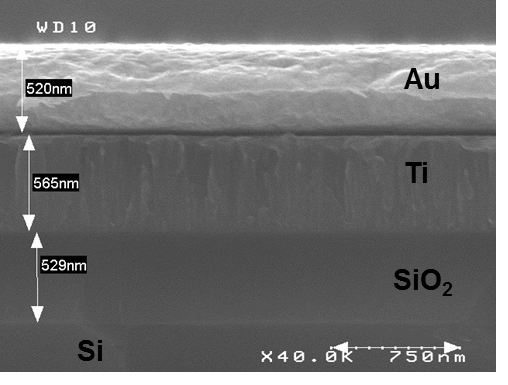
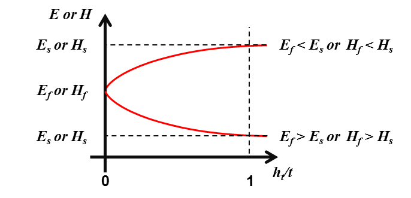
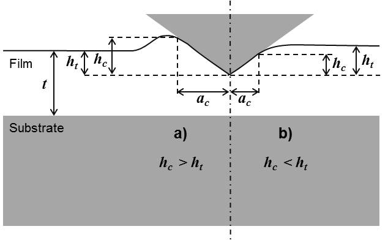

Models for thin films
======================

.. include:: includes.rst

The following parts give a short overview of models existing in the
literature used for the extraction of mechanical properties of thin films
deposited on a substrate from indentation experiments with conical indenters.

Before everything, it is is worth to mention the work performed by Jennett N. M. and Bushby A. J. [#Jennett_2001]_, about nanoindentation test on coatings, during the European project INDICOAT (SMT4-CT98-2249).

Progress from this project help in the development of the ISO standard (ISO 14577 - 1-4).
The ISO 14577 - 4 is dedicated to nanoindentation on coatings.

- `ISO 14577 - 1 , "Metallic materials -- Instrumented indentation test for hardness and materials parameters -- Part 1: Test method", (2002). <http://www.iso.org/iso/home/store/catalogue_tc/catalogue_detail.htm?csnumber=30104>`_

- `ISO 14577 - 2 , "Metallic materials -- Instrumented indentation test for hardness and materials parameters -- Part 2: Verification and calibration of testing machines", (2002). <http://www.iso.org/iso/home/store/catalogue_tc/catalogue_detail.htm?csnumber=30543>`_

- `ISO 14577 - 3 , "Metallic materials -- Instrumented indentation test for hardness and materials parameters -- Part 3: Calibration of reference blocks", (2002). <http://www.iso.org/iso/home/store/catalogue_tc/catalogue_detail.htm?csnumber=32193>`_

- `ISO 14577 - 4 , "Metallic materials -- Instrumented indentation test for hardness and materials parameters -- Part 4: Test method for metallic and non-metallic coatings", (2007). <http://www.iso.org/iso/home/store/catalogue_tc/catalogue_detail.htm?csnumber=39228>`_

Nanoindentation tests on thin films
######################################

Composite reduced Young's modulus and composite hardness
----------------------------------------------------------

For indentation test on a coated specimen or on a multilayer sample (e.g.: thin films deposited on a substrate),
the evolution of the Young's modulus or the hardness calculated with models used for bulk materials,
is function of the material properties and the thickness :math:`t` each underlying film (substrate included),
and the properties and the geometry of the indenter.

   
   *Figure 1 : SEM observation of a multilayer sample.*

   
   *Figure 2 : Typical evolution of Young's modulus and hardness for a coated specimen in function of the normalized indentation depth.*

Thus, the composite reduced Young's modulus :math:`E^{'}` and the composite hardness :math:`H`
calculated with the models used for bulk materials, can generally be expressed as a combination of respectively
the reduced Young's moduli :math:`(E^{'}_\text{f})` or the hardness :math:`(H_\text{f})` of each underlayer and
respectively the reduced Young's modulus :math:`(E^{'}_\text{s})` or the hardness :math:`(H_\text{s})` of the substrate.

    .. math:: E^{'} = f(E^{'}_{\text{f},{i \rightarrow n}}, t_{i \rightarrow n}, E^{'}_\text{s})
            :label: youngs_modulus_evolution

    .. math:: H = f(H_{\text{f},{i \rightarrow n}}, t_{i \rightarrow n}, H_\text{s})
            :label: hardness_evolution

With :math:`i` the indice of the layer and :math:`n` the total number of layers.

Indentation contact topography
-------------------------------

For nanoindentation tests on thin films, the contact topography is function of both thin film and substrate properties.

   
   *Figure 3 : Schematic depiction of a) "pile-up" and b) "sink-in" for thin films.*
   
The Figure 3-a ("pile-up") is typical of the case of a soft film on a hard substrate and the Figure 3-b ("sink-in") of a hard film on a soft substrate [#ChenVlassak2001]_. To determine the depth of contact,
`the same models <http://nims.readthedocs.org/en/latest/models.html#indentation-contact-topography>`_ described for bulk material indentation are used.

Corrections to apply for thin film indentation 
------------------------------------------------

During nanoindentation tests of thin film on substrate, the thickness
of the film beneath the indenter is smaller than its original value,
because of plastic flow during loading. The use of the original film thickness
:math:`t` in the regression model cause a systematic shift or distortion
of the Young's modulus curve. A correction proposed by Mencík et al. can be
applied, assuming a rigid substrate and determining the effective thickness :math:`t_\text{eff}`
[#Mencík_1997]_, [#Saha_2002]_, [#Chen_2004]_, [#Bec_2006]_ and [#Li_2010]_.

    .. math:: \pi a^2 t_\text{eff} = \pi a^2 t - V
            :label: general_thickness_correction

With :math:`V` the volume displaced by the indenter and approximated
by :math:`\pi a^2 h_\text{c} / 3`, for a conical indenter and contact
depths :math:`h_\text{c}` smaller than the film thickness.

    .. math:: t_\text{eff} = t - \frac{h_\text{c}}{3}
            :label: thickness_correction

.. figure:: ./_pictures/thickness_correction.png
   :scale: 60 %
   :align: center
   
   *Figure 4 : Indentation penetration of a thin film on a sample.*
   
Recently, Li et al. proposed to express the local thinning effect as [#Li_2010]_:

    .. math:: t_\text{eff} = t - \eta h_\text{c}
            :label: thickness_correction_Li

With :math:`\eta` a parameter depending on the mechanical properties
of the film and the substrate, and on the geometry of the indenter.
Preliminary finite element calculations show that :math:`\eta` should
be independent of indentation depth and that its value ranges from
0.3 to 0.7 for materials that do not work harden.

Elastic properties of a thin film on a substrate
##################################################

Several models to analyse indentation tests on bilayer sample and multilayer sample and to extract intrinsic
material properties of the upper film (or the top coating) are detailed in the following part.

Some of the following models developed are detailed in the chapter 8 
("Nanoindentation of Thin Films") of the book "Nanoindentation" written by A.C. Fischer-Cripps [#FischerCripps_2004]_.

Bückle (1961) 
--------------

Bückle proposed an empirical law to characterize thick coatings on a substrate [#Bückle_1961]_.
It is possible to estimate the Young's modulus of the coating for indentation depth lower than 10% of the film thickness.
But, because of the imperfections of the indenters, the roughness and the surface pollution,
it is more meaningful to use this rule of the "10%", for film thicker than 500nm.

Doerner and Nix (1986) 
-------------------------

The model of Doerner and Nix is detailed in many papers [#DoernerNix_1986]_, [#King_1987]_, [#Pharr_1992]_ and [#Saha_2002]_, and is described by the following equation :

    .. math:: \frac{1}{E^{'}} = \frac{1}{E_\text{f}^{'}} + \left(\frac{1}{E_\text{s}^{'}}
              - \frac{1}{E_\text{f}^{'}}\right) e^{-\alpha\left(x\right)}
            :label: doerner_nix

With :math:`x=t/h_\text{c}` and :math:`\alpha` an empirically constant
determined using the method of least squares.

The equation was modified by King [#King_1987]_ with the replacement of :math:`t/h_\text{c}` by :math:`t/a_\text{c}`, and then by Saha and Nix [#Saha_2002]_ with the replacement of :math:`t/h_\text{c}` by :math:`(t-h_\text{c})/a_\text{c}`.

An empirical formulae based on the model of Doerner and Nix was proposed by Chen et al. in 2004 [#Chen_2004]_:

    .. math:: \frac{1}{E^{'}} = \frac{1}{E_\text{f}^{'}}\left[1-e^{-\alpha\left(x\right)^{(2/3)}}\right] + 
              \frac{1}{E_\text{s}^{'}}e^{-\alpha\left(x\right)^{(2/3)}}
            :label: chen

With :math:`x=t/h_\text{c}` and :math:`\alpha` an empirically constant
determined using the method of least squares.

Find here the |matlab| function for the Doerner and Nix model [#DoernerNix_1986]_:
`model_doerner_nix.m <https://github.com/DavidMercier/NIMS/blob/master/Matlab_Code/elastic_models/model_doerner_nix.m>`_.

Find here the |matlab| function for the Doerner and Nix model modified by King [#King_1987]_:
`model_doerner_nix_king.m <https://github.com/DavidMercier/NIMS/blob/master/Matlab_Code/elastic_models/model_doerner_nix_king.m>`_.

Find here the |matlab| function for the Doerner and Nix model modified by Saha [#Saha_2002]_:
`model_doerner_nix_saha.m <https://github.com/DavidMercier/NIMS/blob/master/Matlab_Code/elastic_models/model_doerner_nix_saha.m>`_.

Find here the |matlab| function function for the Doerner and Nix model modified by Chen [#Chen_2004]_:
`model_chen.m <https://github.com/DavidMercier/NIMS/blob/master/Matlab_Code/elastic_models/model_doerner_nix_chen.m>`_.

Gao et al. (1992) 
------------------

The model of Gao is described by the following equation [#Gao_1992]_ :

    .. math:: E^{'} = E^{'}_\text{s} + \left(E^{'}_\text{f} - 
              E^{'}_\text{s}\right) \phi_{Gao_0}\left(x\right)
            :label: gao

    .. math:: \phi_{Gao_0} = \frac{2}{\pi} arctan \frac{1}{x} + 
              \frac{1}{{2\pi\left(1-\nu_\text{c}\right)}} 
              \left[\left(1-2\nu_\text{c}\right)\frac{1}{x}ln 
              \left(1 + x^2 \right) - \frac{x}{{1+x^2}}\right]
            :label: phi_gao_0

    .. math:: \nu_{c} = 1 + \left[{\frac{\left(1-\nu_\text{s}\right)
              \left(1-\nu_\text{f}\right)}
              {1-\left(1-\phi_{Gao_1}\right)\nu_\text{f} - 
              \phi_{Gao_1}\nu_\text{s}}}\right]
            :label: poisson_ratio_composite

With :math:`\nu_{c}` the composite Poisson's ratio, :math:`\nu_{s}` the Poisson's
ratio of the substrate and :math:`\nu_{f}` the Poisson's ratio of the thin film.

    .. math:: \phi_{Gao_1} = \frac{2}{\pi} arctan \frac{1}{x} +
              \frac{1}{{x\pi}}ln \left(1+x^2 \right)
            :label: phi_gao_1

With :math:`x=a_\text{c}/t`.

Find here the |matlab| function for the weighting function :math:`\phi_{Gao_0}` :
`phi_gao_0.m <https://github.com/DavidMercier/NIMS/blob/master/Matlab_Code/elastic_models/phi_gao_0.m>`_.

Find here the |matlab| function for the weighting function :math:`\phi_{Gao_1}` :
`phi_gao_1.m <https://github.com/DavidMercier/NIMS/blob/master/Matlab_Code/elastic_models/phi_gao_1.m>`_.

Find here the |matlab| function for :math:`\nu_{c}` the composite Poisson's ratio :
`composite_poissons_ratio.m <https://github.com/DavidMercier/NIMS/blob/master/Matlab_Code/elastic_models/composite_poissons_ratio.m>`_.

Find here the |matlab| function for the Gao et al. model :
`model_gao.m <https://github.com/DavidMercier/NIMS/blob/master/Matlab_Code/elastic_models/model_gao.m>`_.

Mencík et al. (1997) 
-----------------------

Mencík et al. proposed the following structures to express the combination of
:math:`E^{'}_\text{f}` and :math:`E^{'}_\text{s}` [#Mencík_1997]_.
         
    .. math:: E^{'} = E^{'}_\text{s} + \left(E^{'}_\text{f} - E^{'}_\text{s}\right) \phi\left(x\right)
            :label: youngs_modulus_evolution_phi

    .. math:: E^{'} = E^{'}_\text{s} + \left(E^{'}_\text{f} - E^{'}_\text{s}\right) \psi\left(x\right)
            :label: youngs_modulus_evolution_psi
            
Where :math:`x` is the ratio of the contact radius (:math:`a_\text{c}`) or the
contact depth (:math:`h_\text{c}`), to the film thickness (:math:`t`), and 
:math:`\phi` and :math:`\psi` are weight functions of the relative penetration :math:`x`.
:math:`\phi` is equal to 1 when :math:`x` is equal to 0 and 0 when :math:`x` is infinite.
           
.. note::
    If the difference between Poisson's ratio of the thin film and substrate is small,
    the values for uniaxial loading Young's moduli, :math:`E`, :math:`E_\text{f}`,
    :math:`E_\text{s}` can be used in previous equation.
    
Mencík et al. (linear model) (1997) 
------------------------------------

Mencík described too the linear model by the following expression [#Mencík_1997]_ :

    .. math:: E^{'} = E^{'}_\text{f} + \left(E^{'}_\text{s} -
              E^{'}_\text{f}\right)\left(x\right)
            :label: mencik_linear

With :math:`x=a_\text{c}/t`.

Find here the |matlab| function for the Mencík et al. linear function :
`model_menick_linear.m <https://github.com/DavidMercier/NIMS/blob/master/Matlab_Code/elastic_models/model_mencik_linear.m>`_.

Mencík et al. (exponential model) (1997) 
-------------------------------------------

Mencík described the exponential model by the following expression [#Mencík_1997]_ :

    .. math:: E^{'} = E^{'}_\text{s} + \left(E^{'}_\text{f} - 
              E^{'}_\text{s}\right) e^{-\alpha\left(x\right)}
            :label: mencik_exponential

With :math:`x=a_\text{c}/t` and :math:`\alpha` is an empirically
constant determined using the method of least squares.

Find here the |matlab| function for the Mencík et al. exponential function :
`model_menick_exponential.m <https://github.com/DavidMercier/NIMS/blob/master/Matlab_Code/elastic_models/model_mencik_exponential.m>`_.

Mencík et al. (reciprocal exponential model) (1997) 
-----------------------------------------------------

Mencík described the reciprocal exponential model by the following expression [#Mencík_1997]_ :

    .. math:: \frac{1}{E^{'}} = \frac{1}{E_\text{s}^{'}} + 
              \left(\frac{1}{E_\text{f}^{'}} - 
              \frac{1}{E_\text{s}^{'}}\right) e^{-\alpha\left(x\right)}
            :label: mencik_reciprocal_exponential

With :math:`x=a_\text{c}/t` and :math:`\alpha` is an empirically
constant determined using the method of least squares.

Find here the |matlab| function for the Mencík et al. reciprocal exponential function :
`model_menick_reciprocal_exponential.m <https://github.com/DavidMercier/NIMS/blob/master/Matlab_Code/elastic_models/model_mencik_reciprocal_exponential.m>`_.

Perriot et al. (2003) 
-----------------------

The following system of equation describes the model developed by Perriot et al. [#Perriot_2004]_ :

    .. math:: E^{'} = E^{'}_\text{f} + \frac{E^{'}_\text{s}-E^{'}_\text{f}}
              {1+\left(\frac{k_0}{x}\right)^n}
            :label: perriot_barthel

    .. math:: log(k_0) = -0.093+0.792log\left(\frac{E^{'}_\text{s}}
              {E^{'}_\text{f}}\right) + 
              0.05\left[log\frac{E^{'}_\text{s}}{E^{'}_\text{f}}\right]^2
            :label: perriot_barthel_k0

With :math:`x=a_\text{c}/t`, and :math:`k_0` and :math:`n` are 
adjustable constants determined using the method of least squares.

Find here the |matlab| function for the Perriot et al. model :
`model_perriot_barthel.m <https://github.com/DavidMercier/NIMS/blob/master/Matlab_Code/elastic_models/model_perriot_barthel.m>`_.

Jung et al. (2004) 
---------------------

Jung et al. [#Jung_2004]_ have adapted for conical indentation of thin films,
the simple empirical approach of Hu and Lawn [#Hu_1998]_ developed initially
for spherical indentation on bilayer structures. The following power-law relationship
allows the evaluation of the Young's modulus of a thin film deposited on a
substrate from nanoindentation experiments :

    .. math:: E = E_\text{s} {\left(\frac{E_\text{f}}{E_\text{s}}\right)}^L
            :label: jung

with :math:`L` is the exponent term described by a dimensionless function :

    .. math:: L = \frac{1}{\left[1+A{x}^B\right]}
            :label: jung_sigmoidal

With :math:`x=h_\text{c}/t` and where :math:`A` and :math:`B` are adjustable coefficients.

Jung et al. founded :math:`A=3.76` and :math:`B=1.38` after regression fits of :eq:`jung` to different data sets. These coefficients are not universal and need to be "calibrated" with experimental data
or with finite element data for specified material systems.

Finally, to be more consistent with other analytical models implemented in this toolbox, the model of Jung is modified by using the reduced form of the Young's moduli :

     .. math:: E^{'} = E^{'}_\text{s} {\left(\frac{E^{'}_\text{f}}{E^{'}_\text{s}}\right)}^L
            :label: jung_reduced

Find here the |matlab| function for the sigmoidal function used in the Jung's model :
`sigmoidal_jung.m <https://github.com/DavidMercier/NIMS/blob/master/Matlab_Code/elastic_models/sigmoidal_jung.m>`_.

Find here the |matlab| function for the Jung et al. model :
`jung.m <https://github.com/DavidMercier/NIMS/blob/master/Matlab_Code/elastic_models/model_jung.m>`_.

Bec et al. (2006) 
-------------------

The elastic model of Bec et al. is based on indentation by a rigid cylindrical punch (radius :math:`a_\text{c}`)
of a homogeneous film deposited on a semi-infinite half space [#Bec_2006]_.

This system is modelled by two springs connected in series :

.. figure:: ./_pictures/Bec_bilayer_model.png
   :scale: 40 %
   :align: center
   
   *Figure 5 : Schematic description of the bilayer model of Bec et al.*

    .. math:: K_\text{f} = \pi a_\text{c}^2 \frac{E^{'}_\text{f}}{t}
            :label: bec_kf
            
    .. math:: K_\text{s} = 2 a_\text{c} E^{'}_\text{s}
            :label: bec_ks

    .. math:: K_\text{z} = 2 a_\text{c} E^{'}
            :label: bec_kz
                       
    .. math:: \frac{1}{K_\text{z}} =
              \frac{1}{{f_\text{f}\left(a_\text{c}\right) K_\text{f}}} +
              \frac{1}{{f_\text{s}\left(a_\text{c}\right)K_\text{s}}}
            :label: bec_sum_kf_ks

    .. math:: f_\text{f}\left(a_\text{c}\right) =
              f_\text{s}\left(a_\text{c}\right) =
              1 + {\frac{2t}{\pi a_\text{c}}}
            :label: bec_f_ac
            
    .. math:: \frac{1}{2 a_\text{c} E^{'}} = \frac{t}{\left(\pi a_\text{c}^2 +
              2ta_\text{c}\right)E^{'}_\text{f}} + \frac{1}{2\left(a_\text{c} +
              \frac{2t}{\pi}\right)E^{'}_\text{s}}
            :label: bec_Eeq

Find here the |matlab| function for the Bec et al. model :
`model_bec.m <https://github.com/DavidMercier/NIMS/blob/master/Matlab_Code/elastic_models/model_bec.m>`_.
            
Hay et al. (2011) 
-------------------

The present model of Hay et al. [#Hay_2011]_ is a development of the Song–Pharr model [#Rar_2002]_
and [#Xu_2006]_, which is already inspired by the Gao model [#Gao_1992]_.

    .. math:: \frac{1}{\mu_\text{c}} = \left(1-\phi_{Gao_0}\right)
              \frac{1}{\mu_\text{s} + F\phi_{Gao_0}\mu_\text{f}} +
              \phi_{Gao_0}\frac{1}{\mu_\text{f}}
            :label: hay_model
            
Where :math:`\mu_\text{c}` is the composite shear modulus
calculated from the composite Young’s modulus as :

    .. math:: \mu_\text{c} = \frac{E}{2\left(1+\nu_\text{c}\right)}
            :label: hay_muc
            
Where :math:`\nu_\text{c}` is the composite Poisson's ratio given in Gao's model.

    .. math:: E = \left(1 - \nu_\text{c}^2\right)E^{'}
            :label: hay_Ec

Knowing :math:`\mu_\text{c}`, it is possible to calculate :math:`\mu_\text{f}` :

    .. math:: \mu_\text{f} = \frac{-B + \sqrt{B^2-4AC}}{2A}
            :label: hay_muf
            
Where :math:`A = F \phi_{Gao_0}`
            
    .. math:: B = \mu_\text{s} - \left(F \phi_{Gao_0}^2 - 
              \phi_{Gao_0} + 1\right)\mu_\text{c}
            :label: hay_B

With :math:`F = 0.0626`, a constant obtained from finite element simulations.
            
    .. math:: C = -\phi_{Gao_0}\mu_\text{c}\mu_\text{s}
            :label: hay_C
            
    .. math:: \mu_\text{s} = \frac{E_\text{s}}{2\left(1+\nu_\text{s}\right)}
            :label: hay_mus
            
Finally, the Young’s modulus of the film is calculated from
the shear modulus and Poisson’s ratio of the film :

    .. math:: E_\text{f} = 2\mu_\text{f}\left(1 + \nu_\text{f}\right)
            :label: hay_Ef

Find here the |matlab| function for the Hay et al. model :
`model_hay.m <https://github.com/DavidMercier/NIMS/blob/master/Matlab_Code/elastic_models/model_hay.m>`_.

Bull (2014) 
-------------------
This model is a simple method to determine the elastic modulus
of a coating on a substrate using nanoindentation based on the
load support of a truncated cone of material beneath the indenter [#Bull_2014]_.

    .. math:: E = \frac{F_\text{c}}{2a_0\left(h_\text{c} + h_\text{s} \right)}
            :label: bull_contact_modulus
            
    .. math:: h_\text{c} = \frac{F_\text{c}}{\pi E_\text{f}} \left[ \frac{1}{a_0 tan\alpha} - \frac{1}{a_0 tan\alpha + t_\text{f} tan^2\alpha} \right]
            :label: bull_disp_coating

    .. math:: h_\text{s} = \frac{F_\text{c}}{\pi E_\text{s}} \left[ \frac{1}{a_0 tan\alpha + t_\text{f} tan^2\alpha} - \frac{1}{a_0 tan\alpha + (t_\text{f} + t_\text{s}) tan^2\alpha} \right]
            :label: bull_disp_substrate

Where :math:`E_\text{f}` and :math:`E_\text{s}` are the Young's Modulus of the coating and
substrate, :math:`t_\text{f}` and :math:`t_\text{s}` are the coating and substrate thickness,
and :math:`\alpha` is the semi-angle of the cone material which supports the load. 

Elastic properties of a thin film on a multilayer system
###############################################################

In 2008, Pailler-Mattei et al. proposed an extension of the Bec's model to a bilayer system deposited on a substrate [#PaillerMattei_2008]_.

But more recently, Mercier et al. established a generalization of the Bec's mdoel to :math:`N+1` layers sample.

Mercier et al. (2010) 
----------------------

The elastic model of Mercier et al. for a multilayer sample on
:math:`N+1` layers is an extension of the Bec et al. model [#Mercier_2010]_ and [#Mercier_2013]_.
                      
    .. math:: \frac{1}{2 a_{\text{c},0} E^{'}} = \sum_{i=0}^{N}
              \frac{t_i}{\left(\pi a_{\text{c},i}^2 + 2t_ia_{\text{c},i}\right)E^{'}_{\text{f},i}} +
              \frac{1}{2\left(a_{\text{c},N} + \frac{2t_N}{\pi}\right)E^{'}_\text{s}}
            :label: mercier_Eeq
            
    .. math:: a_{\text{c},i+1} = a_{\text{c},i} + \frac{2t}{\pi}
            :label: mercier_ac
            
With :math:`a_{\text{c},0}` equal to :math:`a_{\text{c}}`.

Thus, the Young’s modulus of the film can be calculated as :

    .. math:: E^{'}_{\text{f},0} = \left[\frac{\pi a_{\text{c},0}^2 +
              2t_0a_{\text{c},0}}{t_0} \left[\frac{1}{2 a_{\text{c},0} E^{'}} -
              {\left(\sum_{i=1}^{N} {\frac{t_i}{\left(\pi a_{\text{c},i}^2 + 
              2t_ia_{\text{c},i}\right)E^{'}_{\text{f},i}} + 
              \frac{1}{2\left(a_{\text{c},N} + 
              \frac{2t_N}{\pi}\right)E^{'}_\text{s}}}\right)}\right]\right]^{-1}
            :label: mercier_Ef

.. figure:: ./_pictures/multilayer_sample_elastic_model.png
   :scale: 30 %
   :align: center
   
   *Figure 6 : Schematic of elastic multilayer model.*

It is advised to perform nanoindentation tests on each layer of the multilayer sample,
from the substrate up to the final stack of layers (see Figure 7). By successive iterations using
the model of Mercier et al., values of Young's modulus of each layer are extracted
from the contact stiffness.

.. figure:: ./_pictures/multilayer_sample_methodology.png
   :scale: 30 %
   :align: center
   
   *Figure 7 : Experimental process to apply for elastic multilayer model.*

Find here the |matlab| function for the Mercier et al. model :
`model_multilayer_elastic.m <https://github.com/DavidMercier/NIMS/blob/master/Matlab_Code/elastic_models/model_multilayer_elastic.m>`_.

Plastic properties of a thin film on a substrate
###################################################

It is possible to estimate empirically the hardness of the coating for indentation depth lower than 40% of the film thickness. But, because of the imperfections of the indenters, the roughness and the surface pollution, it is more meaningful to use this rule of the "40%", for film thicker than 500nm.

Bückle (1961)
-----------------

Bückle proposed an expression of the composite hardness in the case of a two-layer material
with a weighted sum of the different layer hardnesses during indentation process [#Bückle_1961]_.

    .. math:: H = aH_\text{f} + bH_\text{s}
            :label: buckle_hardness

With :math:`a + b = 1`. :math:`a` varies from 1 when the hardness is not affected by the substrate,
to 0 when the indentation depth is approaching the film thickness.

Jönsson and Hogmark (1984)
---------------------------

Jönsson and Hogmark used a simple geometrical approach based on a area
"law of mixtures" to separate the substrate and film contributions
to the measured hardness from Vickers indentation [#Jönsson_1984]_.

    .. math:: H = \frac{A_\text{f}}{A}H_\text{f} + \frac{A_\text{s}}{A}H_\text{s}
            :label: jonsson_hardness

With :math:`A_\text{f}` the area on which the mean pressure :math:`H_\text{f}` acts and
:math:`A_\text{s}` the area on which the mean pressure :math:`H_\text{s}` acts. The total area
:math:`A` is the sum of :math:`A_\text{f}` and :math:`A_\text{s}` and the following expressions for the area ratios  are given by Jönsson and Hogmark:

    .. math:: \frac{A_\text{f}}{A} = 2C\frac{t}{d} - C^2{\frac{t}{d}}^2
            :label: jonsson_area_ratio_1

    .. math:: \frac{A_\text{s}}{A} = 1 - \frac{A_\text{f}}{A}
            :label: jonsson_area_ratio_2

With :math:`d` the diagonal of the indent, :math:`t` the film thickness
and :math:`C` a constant equal to 0.5 for hard coatings on very soft substrates
(:math:`6.3 < \frac{H_\text{f}}{H_\text{s}} < 12.9`) or to 1 when the coatings and
substrate hardnesses are more similar (:math:`1.8 < \frac{H_\text{f}}{H_\text{s}} < 2.3`).

[#Iost_1996]_

Burnett and Rickerby (1984)
---------------------------

Burnett and Rickerby proposed afterwards a model based on a “volume law of
mixtures” similar to Jönsson's relation, considering the volumes of the plastic zones, :math:`V_\text{f}` and :math:`V_\text{s}` respectively in the film and in the substrate [#Burnett1_1987]_ [#Burnett2_1987]_.

    .. math:: H = \frac{V_\text{f}}{V}H_\text{f} + \frac{V_\text{s}}{V}H_\text{s}
            :label: burnett_hardness

With :math:`V = V_\text{f} + V_\text{s}`. 

Chicot and Lesage (1995)
---------------------------

“volume law of
mixtures”

[#ChicotLesage_1995]_

[#He_1996]_

[#Korsunsky_1998]_

[#Fernandes_2000]_

Saha and Nix (2002)
---------------------------

Based on the methodology proposed by Joslin and Oliver (1990) [#Joslin_1990]_ for a bulk material,
extended to the coated system by Page et al. [#Page_1998]_, Saha and Nix proposed
to use the following equation, giving the evolution of the hardness in function
of indentation depth, even when pile-up occurs [#Saha_2002]_:

    .. math:: H = {\beta}^2 \frac{4}{\pi} \frac{F_\text{c,max}}{S^2} E^{*2}
            :label: hardness_saha
            
    .. math:: \frac{1}{E^{*}} = \frac{1}{E_\text{i}^{'}} + \frac{1}{E_\text{f}^{'}} + \left(\frac{1}{E_\text{s}^{'}} - \frac{1}{E_\text{f}^{'}}\right) e^{-\alpha\left(x\right)}
            :label: doerner_nix_saha

With :math:`x=(t-h_\text{c})/a_\text{c}` and :math:`E_\text{i}^{'}` the reduced Young's modulus of the indenter.

This model was reused later by [#Han_2005]_ and [#Han_2006]_.

.. note::
    This model is valid only for the case of elastically inhomogeneous film/substrate systems.
    
Chen (2004)
---------------------------

[#Chen_2004]_

Iost (2005)
---------------------------

[#Iost_2005]_

Plastic properties of a thin film on a multilayer system
##########################################################

[#Rahmoun_2009]_

[#Arrazat_2010]_

References
#############

.. [#Arrazat_2010] `Arrazat B. et al., "Nano indentation de couches dures ultra minces de ruthénium sur or" (2010). <http://dx.doi.org/10.1051/mattech/2011031>`_
.. [#Bec_2006] `Bec S. et al., "Improvements in the indentation method with a surface force apparatus" (2006). <http://dx.doi.org/10.1080/01418619608239707>`_
.. [#Bückle_1961] Bückle H., "VDI Berichte" (1961).
.. [#Bull_2014] `Bull S.J., "A simple method for the assessment of the contact modulus for coated systems." (2014). <http://dx.doi.org/10.1080/14786435.2014.909612>`_
.. [#Burnett1_1987] `Burnett P.J. and Rickerby D.S., "The mechanical properties of wear-resistant coatings: I: Modelling of hardness behaviour." (1987). <http://dx.doi.org/10.1016/0040-6090(87)90119-2>`_
.. [#Burnett2_1987] `Burnett P.J. and Rickerby D.S., "The mechanical properties of wear-resistant coatings: II: Experimental studies and interpretation of hardness." (1987). <http://dx.doi.org/10.1016/0040-6090(87)90120-9>`_
.. [#ChenVlassak2001] `Chen X. and Vlassak J.J., "Numerical study on the measurement of thin film mechanical properties by means of nanoindentation." (2001). <http://dx.doi.org/10.1557/JMR.2001.0408>`_
.. [#Chen_2004] `Chen S. et al., "Nanoindentation of thin-film-substrate system: Determination of film hardness and Young's modulus" (2004). <http://dx.doi.org/10.1007/BF02489376>`_
.. [#ChicotLesage_1995] `Chicot D. and Lesage J., "Absolute hardness of films and coatings" (1995). <http://dx.doi.org/10.1016/j.mechmat.2007.07.002>`_
.. [#DoernerNix_1986] `Doerner M.F. and Nix W.D., "A method for interpreting the data from depth-sensing indentation instruments" (1986). <http://dx.doi.org/10.1557/JMR.1986.0601>`_
.. [#Fernandes_2000] `Fernandes J.V. et al., "A model for coated surface hardness" (2000). <http://dx.doi.org/10.1016/S0257-8972(00)00839-2>`_
.. [#FischerCripps_2004] `Fischer-Cripps, A.C., "Nanoindentation 2nd ed." (2004) <http://link.springer.com/book/10.1007%2F978-1-4419-9872-9>`_
.. [#Gao_1992] `Gao H. et al., "Elastic contact versus indentation modeling of multi-layered materials" (1992). <http://dx.doi.org/10.1016/0020-7683(92)90004-D>`_
.. [#Han_2005] `Han S.M. et al., "Combinatorial studies of mechanical properties of Ti–Al thin films using nanoindentation" (2005). <http://dx.doi.org/10.1016/j.actamat.2005.01.017>`_
.. [#Han_2006] `Han S.M. et al., "Determining hardness of thin films in elastically mismatched film-on-substrate systems using nanoindentation" (2006). <http://dx.doi.org/10.1016/j.actamat.2005.11.026>`_
.. [#Hay_2011] `Hay J. and Crawford B., "Measuring substrate-independent modulus of thin films" (2011). <http://dx.doi.org/10.1557/jmr.2011.8>`_
.. [#He_1996] `He J.L. et al., "Hardness measurement of thin films: Separation from composite hardness" (1996). <http://dx.doi.org/10.1063/1.117595>`_
.. [#Hu_1998] `Hu X.Z. and Lawn B. R. "A simple indentation stress–strain relation for contacts with spheres on bilayer structures" (1998). <http://dx.doi.org/10.1016/S0040-6090(97)00919-X>`_
.. [#Iost_1996] `Iost A. and Bigot R., "Hardness of coatings" (1996). <http://dx.doi.org/10.1016/0257-8972(95)02697-5>`_
.. [#Iost_2005] `Iost A. et al., "Dureté des revêtements : quel modèle choisir ?" (2005). <http://dx.doi.org/10.1051/mattech:2005009>`_
.. [#Jennett_2001] `Jennett N. M. and Bushby A. J., "Adaptive Protocol for Robust Estimates of Coatings Properties by Nanoindentation" (2001). <http://dx.doi.org/10.1557/PROC-695-L3.1.1>`_
.. [#Jönsson_1984] `Jönsson B. and Hogmark S., "Hardness measurements of thin films" (1984). <http://dx.doi.org/10.1016/0040-6090(84)90123-8>`_
.. [#Joslin_1990] `Joslin D.L. and Oliver W.C., "A new method for analyzing data from continuous depth-sensing microindentation tests" (1990). <http://dx.doi.org/10.1557/JMR.1990.0123>`_
.. [#Jung_2004] `Jung Y.-G. et al. "Evaluation of elastic modulus and hardness of thin films by nanoindentation" (2004). <http://dx.doi.org/10.1557/JMR.2004.0380>`_
.. [#King_1987] `King R.B., "Elastic analysis of some punch problems for a layered medium" (1987). <http://dx.doi.org/10.1016/0020-7683(87)90116-8>`_
.. [#Korsunsky_1998] `Korsunsky A.M. et al. "On the hardness of coated system" (1998). <http://dx.doi.org/10.1016/S0257-8972(97)00522-7>`_
.. [#Li_2010] `Li H. et al., "New methods of analyzing indentation experiments on very thin films" (2010). <http://dx.doi.org/10.1557/JMR.2010.0095>`_
.. [#Mencík_1997] `Mencík J. et al., "Determination of elastic modulus of thin layers using nanoindentation" (1997). <http://dx.doi.org/10.1557/JMR.1997.0327>`_
.. [#Mercier_2010] `Mercier D. et al., "Young's modulus measurement of a thin film from experimental nanoindentation performed on multilayer systems" (2010). <http://dx.doi.org/10.1051/mattech/2011029>`_
.. [#Mercier_2013] `Mercier D., "Behaviour laws of materials used in electrical contacts for « flip chip » technologies" (2013). <http://www.theses.fr/2013GRENI083>`_
.. [#Page_1998] `Page T.F. et al., "Nanoindentation Characterisation of Coated Systems: P:S2 - A New Approach Using the Continuous Stiffness Technique" (1998). <http://dx.doi.org/10.1557/PROC-522-53>`_
.. [#PaillerMattei_2008] `Pailler-Mattei C. et al., "In vivo measurements of the elastic mechanical properties of human skin by indentation tests" (2008). <http://dx.doi.org/10.1016/j.medengphy.2007.06.011>`_
.. [#Perriot_2004] `Perriot A. and Barthel E., "Elastic contact to a coated half-space: Effective elastic modulus and real penetration" (2004). <http://dx.doi.org/10.1557/jmr.2004.19.2.600>`_
.. [#Pharr_1992] `Pharr G.M. and Oliver W.C., "Measurement of Thin Film Mechanical Properties Using Nanoindentation" (1992). <http://dx.doi.org/10.1557/S0883769400041634>`_
.. [#PuchiCabrera_1992] `Puchi-Cabrera. E.S. et al., "A description of the composite elastic modulus of multilayer coated systems" (2015). <http://dx.doi.org/10.1016/j.tsf.2015.02.078>`_
.. [#Rahmoun_2009] `Rahmoun K. et al., "A multilayer model for describing hardness variations of aged porous silicon low-dielectric-constant thin films" (2009). <http://dx.doi.org/10.1016/j.tsf.2009.07.040>`_
.. [#Rar_2002] `Rar A. et al., "Assessment of new relation for the elastic compliance of a film–substrate system." (2002). <http://dx.doi.org/10.1557/PROC-695-L10.10.1>`_ 
.. [#Saha_2002] `Saha R. and Nix W.D., "Effects of the substrate on the determination of thin film mechanical properties by nanoindentation" (2002). <http://dx.doi.org/10.1016/S1359-6454(01)00328-7>`_
.. [#Xu_2006] `Xu H. and Pharr G.M., "An improved relation for the effective elastic compliance of a film/substrate system during indentation by a flat cylindrical punch." (2006). <http://dx.doi.org/10.1016/j.scriptamat.2006.04.037>`_