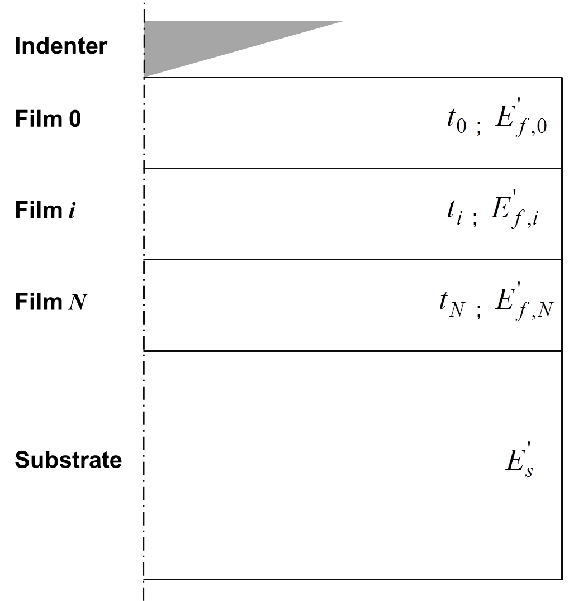
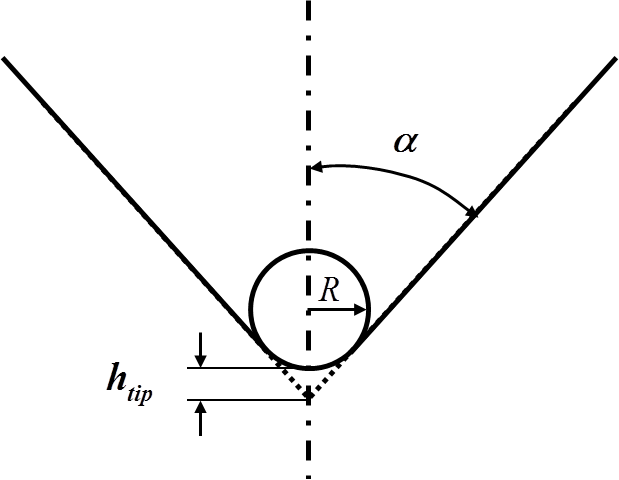
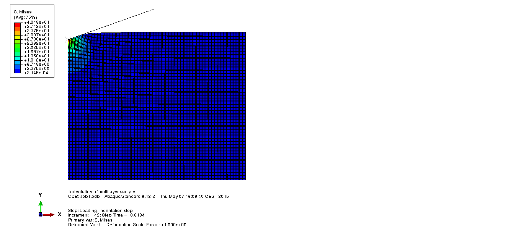
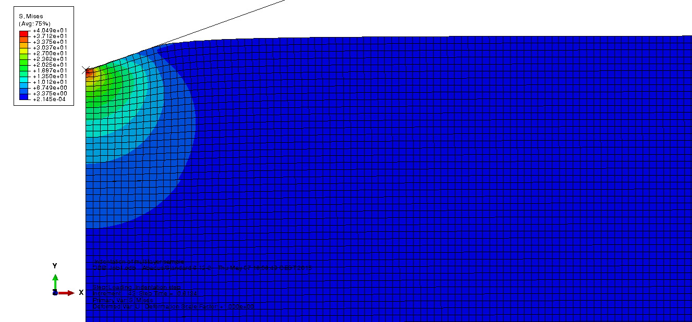
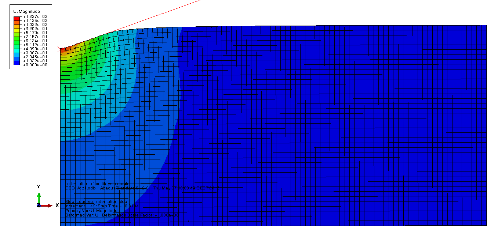

FEM model
====================

.. include:: includes.rst

Finite Element Modelling (FEM) of conical indentation
#######################################################

The present model is a simulation of the conical nanoindentation process,
using the FEM software ABAQUS.

The |matlab| function used to generate a Python script for ABAQUS is :
`python_abaqus <https://github.com/DavidMercier/NIMS/blob/master/matlab_code/fem/python4abaqus.m>`_

The model is axisymmetric with a geometry dependent mesh
and restricted boundaries conditions.

Geometry of the (multilayer) sample
-------------------------------------

Each layer of the sample is characterized by its thickness (:math:`t_\text{i}`).

The thickness of the substrate (:math:`t_\text{sub}`) is set as
2 times the highest thin film thickness.

The width (:math:`w`) of the sample is calculated in function of
the substrate thickness or the indenter tip defect.

No delamination is allowed between thin films or between thin film and substrate.

..  note::
    Dimensions are in nm.
    

   
   *Geometry of the sample in the FEM model.*

Geometry of the indenter
---------------------------------

The indenter is defined as a rigid cono-spherical indenter.
A spherical part is defined at the apex of the conical indenter (see :numref:`conospherical_indenter`).

   
   *Scheme of a cono-spherical indenter.*

The radius :math:`R` of the spherical part is calculated from the tip defect :math:`h_\text{tip}`
and the cone angle :math:`\alpha`, using the following equation. For Berkovich, Vickers and Cube-Corner
indenters, the equivalent cone angle is used to set the cone angle.

    .. math:: R = \frac{h_\text{tip}}{\frac{1}{sin(\alpha)} - 1}
            :label: tip_radius

In case, a perfect conical indenter is set in the GUI (:math:`h_\text{tip} = 0\text{nm}`),
the radius is calculated using a tip defect of 0.1nm by default, which gives a radius of :math:`R = 1.6\text{nm}`.

Defining a spherical tip avoids the geometrical singularity at the apex of the
perfect conical indenter, which would imply an infinite stress at the contact interface.

Mesh
---------------------------------

The multilayer sample is divided by default into solid elements with eight nodes
and axisymmetric deformation element CAX8R is adopted.

It is possible to divide the sample into solid elements with four nodes
and with axisymmetric deformation element CAX4R, by changing the value of the
variable "linear_elements" in the |matlab| function
`python4abaqus <https://github.com/DavidMercier/NIMS/blob/master/matlab_code/fem/python4abaqus.m>`_
from 0 (quadratic elements) to 1 (linear elements).

..  note::
    * CAX4R: A 4-node bilinear axisymmetric quadrilateral, reduced integration, hourglass control.
    * CAX3:  A 3-node linear axisymmetric triangle.
    * CAX8R: An 8-node biquadratic axisymmetric quadrilateral, reduced integration.
    * CAX6M: A 6-node modified quadratic axisymmetric triangle.
    
.. figure:: ./_pictures/fem_model_mesh.png
   :scale: 20 %
   :align: center
   
   *Screenshot in Abaqus of the mesh example used in the FE model.*

Material properties
---------------------------------

For each layers of the multilayer sample, the material properties
(Young's modulus and Poisson's ratio) are defined using the inputs
given by the user from the GUI. Material properties are considered
by default to be isotropic. The density is set by default to 1.0.

..  note::
    Young's moduli are in GPa.

Contact definition
----------------------

The contact is defined by default frictionless for the tangential
behavior and hard for the normal behavior.

The external surface of the indenter is defined as the "master"
region and the top surface of the (multilayer) sample is defined as the "slave" region.

..  note::
    Usually, the effect of friction may be neglected when indenter tips with half-angle
    larger than 60◦ are used (e.g.: Berkovich, Vickers) [#AtkinsTabor_1965]_, [#Johnson_1987]_, 
    [#DiCarlo_2004]_, [#Harsono_2008]_ and [#Wang_2016]_.

Boundaries conditions
------------------------

Nodes are constrained along the rotation axis from moving in the radial direction (:math:`x`).
The nodes on the bottom surface of the sample are constrained along the radial axis
from moving in the radial (:math:`x`) and vertical (:math:`z`) directions (see :numref:`fem_model_bc` and :numref:`fem_model_parts_bc`).

Indentation process is simulated by imposing a vertical displacement
to the rigid indenter along the (:math:`z`) axis (see :numref:`fem_model_bc` and :numref:`fem_model_parts_bc`).
A value of 200nm for the indentation depth is set by default.

.. figure:: ./_pictures/fem_model_bc.png
   :name: fem_model_bc
   :scale: 50 %
   :align: center
   
   *Schematic of boundaries conditions used in the FE model.*
    
.. figure:: ./_pictures/fem_model_parts_bc.png
   :name: fem_model_parts_bc
   :scale: 20 %
   :align: center
   
   *Screenshot of the FE model with BCs in Abaqus.*
   
..  warning::
    Indentation displacement is given in nanometers and is negative.

Generation of the Python script for ABAQUS
#################################################

After material properties are configured (Young's moduli and Poisson's ratios)
and the model geometry is given (thickness for each thin films), 
a Python script for ABAQUS can be generated by pressing the 'FEM' button.

The python script is saved in the folder where your nanoindentation results are stored.

To generate the FEM model in ABAQUS, apply the following procedure:

- start ABAQUS
- select the folder containing input files : 'File' ==> 'Set Work Directory...'
- select and run the Python file containing the FEM model (\*.py) : File' ==> 'Run Script'

..  note::
    Dimensions are in nm and Young's moduli are in GPa, implying that load is in nN.

Results of the FEM simulation
###############################

The following pictures were obtained for a `multilayer Au/Ti/SiO2/Si <https://github.com/DavidMercier/NIMS/blob/master/data_indentation/3films_Au-Ti-SiO2-Si_CSM-1nm.xls>`_.

   
   *Screenshot of the Von Mises stress distribution at maximum load.*

   
   *Screenshot (with a zoom in on the contact area) of the Von Mises stress distribution at maximum load.*
   

   
   *Screenshot (with a zoom in on the contact area) of the magnitude of the displacement at maximum load.*
    
References
############

.. [#AtkinsTabor_1965] `Atkins A.G. and Tabor D., "Plastic indentation in metals with cones" (1965). <http://dx.doi.org/10.1016/0022-5096(65)90018-9>`_
.. [#DiCarlo_2004] `DiCarlo A. et al., "Prediction of stress–strain relation using cone indentation: effect of friction" (2004). <http://dx.doi.org/10.1002/nme.979>`_
.. [#Harsono_2008] `Harsono E. et al., "The effect of friction on indentation test results" (2008). <http://dx.doi.org/10.1088/0965-0393/16/6/065001>`_
.. [#Johnson_1987] Johnson K.L., "Contact Mechanics" (1987), ISBN - 9780521347969.
.. [#Wang_2016] Wang. Y.,, "Effects of indenter angle and friction on the mechanical properties of film materials" (2016). <http://dx.doi.org/10.1016/j.rinp.2016.08.008>`_

* ABAQUS documentation
* `Charleux L., "Abapy Documentation" <http://abapy.readthedocs.org/en/latest/index.html>`_

* `Bhattacharya A.K. and Nix W.D., "Analysis of elastic and plastic deformation associated with indentation testing of thin films on substrates" (1988). <http://dx.doi.org/10.1016/0020-7683(88)90091-1>`_
* `Bhattacharya A.K. and Nix W.D., "Finite element analysis of cone indentation." (1991). <http://dx.doi.org/10.1016/0020-7683(91)90100-T>`_
* `Madsen D.T. et al. "Finite Element Simulation of Indentation Behavior of thin Films." (1991). <http://dx.doi.org/10.1557/PROC-239-431>`_
* `Sun Y. et al., "Finite element analysis of the critical ratio of coating thickness to indentation depth for coating property measurements by nanoindentation." (1995). <http://dx.doi.org/10.1016/0040-6090(94)06357-5>`_
* `Bolshakov A. and Pharr G.M., "Influences of pile-up on the measurement of mechanical properties by load and depth sensing indentation techniques." (1998) <http://dx.doi.org/10.1557/JMR.1998.0146>`_
* `Lichinchi M. et al., "Simulation of Berkovich nanoindentation experiments on thin films using finite element method." (1998). <http://dx.doi.org/10.1016/S0040-6090(97)00739-6>`_
* `Chen X. and Vlassak J.J., "A Finite Element Study on the Nanoindentation of Thin Films." (2000). <http://dx.doi.org/10.1557/PROC-649-Q1.3>`_
* `Chen X. and Vlassak J.J., "Numerical study on the measurement of thin film mechanical properties by means of nanoindentation." (2001). <http://dx.doi.org/10.1557/JMR.2001.0408>`_
* `Bouzakis K.-D. et al., "Thin hard coatings stress–strain curve determination through a FEM supported evaluation of nanoindentation test results.", (2001). <http://dx.doi.org/10.1016/S0257-8972(01)01275-0>`_
* `Hubert N. et al. "Identification of elastic-plastic material parameters from pyramidal indentation of thin films." (2002). <http://dx.doi.org/10.1098/rspa.2001.0927>`_
* `Shan Z. and Sitaraman S.K., "Elastic–plastic characterization of thin films using nanoindentation technique." (2003). <http://dx.doi.org/10.1016/S0040-6090(03)00663-1>`_
* `He J.L. and Veprek S., "Finite element modeling of indentation into superhard coatings." (2003). <http://dx.doi.org/10.1016/S0257-8972(02)00628-X>`_
* `Xu Z.-H. and Rowcliffe D., "Finite element analysis of substrate effects on indentation behaviour of thin films." (2004). <http://dx.doi.org/10.1016/S0040-6090(03)01071-X>`_
* `Panich N. and Sun Y. "Effect of penetration depth on indentation response of soft coatings on hard substrates: a finite element analysis" (2004) <http://dx.doi.org/10.1016/j.surfcoat.2003.07.002>`_
* `Cai X. and Bangert H., "Hardness measurements of thin films-determining the critical ratio of depth to thickness using FEM." (2005). <http://dx.doi.org/10.1016/0040-6090(95)06569-5>`_
* `Bressan J.D. et al., "Modeling of nanoindentation of bulk and thin film by finite element method." (2005). <http://dx.doi.org/10.1016/j.wear.2004.05.021>`_
* `Pelletier H. et al., "Characterization of mechanical properties of thin films using nanoindentation test." (2006) <http://dx.doi.org/10.1016/j.mechmat.2006.02.011>`_
* `Xu H., "A Finite Element Study of the Contact Stiffness of Homogenous Materials and Thin Films." PhD thesis - University of Tennessee - Knoxville (2007) <http://etd.utk.edu/2007/XuHaitao.pdf>`_
* `Antunes J.M. et al., "On the determination of the Young's modulus of thin films using indentation tests" (2007). <http://dx.doi.org/10.1016/j.ijsolstr.2007.06.015>`_
* `Chen S.H. et al., "Small scale, grain size and substrate effects in nano-indentation experiment of film–substrate systems." (2007). <http://dx.doi.org/10.1016/j.ijsolstr.2006.11.033>`_
* `Huang X. and Pelegri A.A., "Finite element analysis on nanoindentation with friction contact at the film/substrate interface." (2007). <http://dx.doi.org/10.1016/j.compscitech.2006.10.005>`_
* Kopernik M. and Pietrzyk M., "2d numerical simulation of elasto-plastic deformation of thin hard coating systems in deep nanoindentation test with sharp indenter." (2007).
* `Pelegri A.A. and Huang X., "Nanoindentation on soft film/hard substrate and hard film/soft substrate material systems with finite element analysis." (2008). <http://dx.doi.org/10.1016/j.compscitech.2007.05.033>`_
* `Wittler O. et al., "Mechanical characterisation of thin metal layers by modelling of the nanoindentation experiment." (2008). <http://dx.doi.org/10.1109/ESTC.2008.4684488>`_
* `Sakharova N.A. et al., "Comparison between Berkovich, Vickers and conical indentation tests: A three-dimensional numerical simulation study." (2009). <http://dx.doi.org/10.1016/j.ijsolstr.2008.10.032>`_
* `Gonzalez M. et al., "Modeling the substrate effects on nanoindentation mechanical property measurement." (2009). <http://dx.doi.org/10.1109/ESIME.2009.4938456>`_
* `Chen C., "2-D Finite Element Modeling for Nanoindentation and Fracture Stress Analysis.", PhD thesis - University of South Florida (2009). <http://scholarcommons.usf.edu/etd/1897/>`_
* `Moore S.W. et al., "Nanoindentation in elastoplastic materials: insights from numerical simulations." (2010). <http://dx.doi.org/10.1080/19475411003589889>`_
* `Wang J.S. et al., "Identification of elastic parameters of transversely isotropic thin films by combining nanoindentation and FEM analysis." (2010). <http://dx.doi.org/10.1016/j.commatsci.2010.05.025>`_
* `Miller D.C. et al., "Thermo-mechanical properties of alumina films created using the atomic layer deposition technique." (2010). <http://dx.doi.org/10.1016/j.sna.2010.09.018>`_
* `Dowhan L. et al., "Investigation of thin films by nanoindentation with doe and numerical methods." (2011). <http://doi.org/10.1109/ESIME.2011.5765768>`_
* `Isselé H. et al., "Determination of the Young's modulus of a TiN Thin Film by nanoindentation: analytical models and numerical FEM simulation." (2012). <http://doi.org/10.1380/ejssnt.2012.624>`_
* `Phiciato's blog (2013) <https://phiciato.wordpress.com/2013/07/11/abaqus-simple-case-indentation-of-thin-coating/>`_
* `Karimpour M. et al., "An inverse method for extracting the mechanical properties of the constituent materials of a multilayer from nanoindentation data." (2013). <http://doi.org/10.1016/j.commatsci.2012.11.007>`_
* `Moćko W. et al., "Simulation of nanoindentation experiments of single-layer and double-layer thin films using finite element method." (2014). <http://doi.org/10.1002/sia.5473>`_
* `Kibech S. et al., "Nanoindentation" (2014). <https://nanohub.org/resources/nanoindentation>`_
* `Kopernik M. and Milenin A., "Numerical modeling of substrate effect on determination of elastic and plastic properties of TiN nanocoating in nanoindentation test." (2014). <http://doi.org/10.1016/j.acme.2013.10.001>`_
* `Li Y. et al., "Models for nanoindentation of compliant films on stiff substrates" (2015). <http://dx.doi.org/10.1557/jmr.2015.126>`_
* `Moreau S. et al., "Application of Design of Computer Experiments (DoCE) method for the extraction of the elasto-plastic behavior law of ECD copper through nano-indentation tests" (2015). <http://dx.doi.org/10.1109/EuroSimE.2015.7103084>`_
* `Gupta A. K. et al., "Evaluation of elasto-plastic properties of ITO film using combined nanoindentation and finite element approach" (2015). <http://dx.doi.org/10.1016/j.ceramint.2015.09.054>`_
* `Veprek-Heijman M.G.J. and Veprek S., "The deformation of the substrate during indentation into superhard coatings: Bückle's rule revised" (2016). <http://dx.doi.org/10.1016/j.surfcoat.2015.10.064>`_
